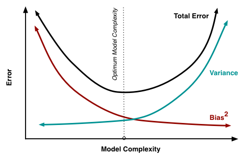
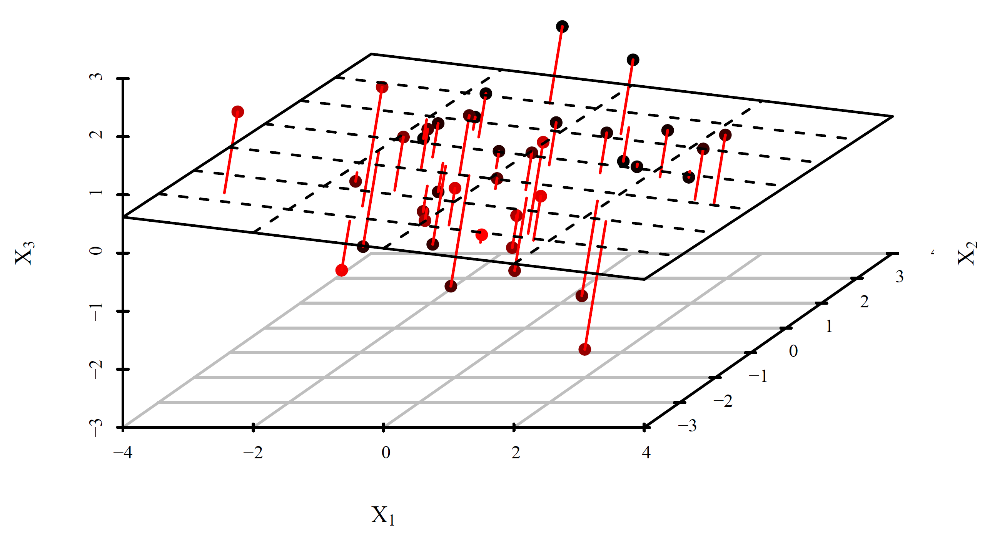
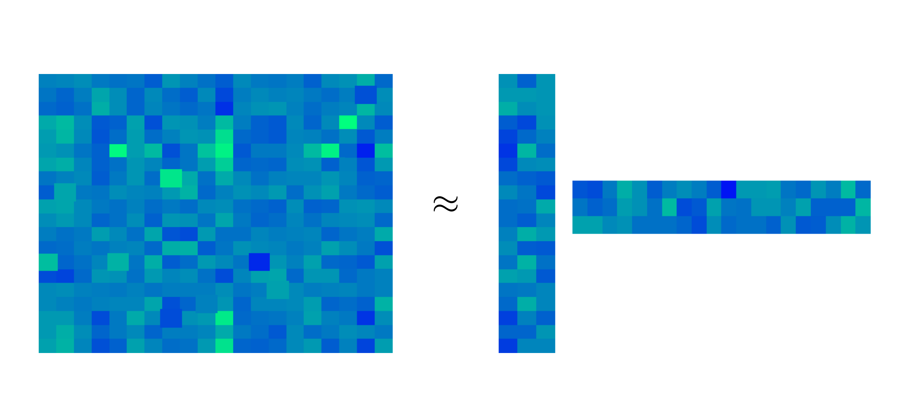

```{r setup, include=FALSE}
knitr::opts_chunk$set(echo = TRUE)
```

Cross-validation (CV) is a way to asses the prediction capacity of a model by splitting the data set into several *folds*. It can be naturally used to choose between several candidate models (choosing the one with the best prediction capacity). As such, it is often used to select tuning parameters of a model (e.g. the bandwidth in local regression or the parameter $\lambda$ in ridge regression or lasso).

More generally, CV is often hailed as the overarching approach to tuning parameter selection by splitting the data set in a broad range of models/algorithms. However, when the problem is unsupervised (i.e. there is no response) and it is not clear how to use the model for prediction, one has to think carefully about how to devise a CV strategy.

# Bandwidth Selection for Local Regression

Setup: From a sample $(x_1,y_1)^\top,\ldots, (x_N,y_N)^\top \in \R^2$ and for a fixed bandwidth $h$, we are estimating $m(x) = \E[Y|X=x]$ as $\widehat{m}_h(x)$ by e.g. local linear regression.

Question: How to choose $h$?

We can aim for $h$ which minimizes the mean integrated squared error (MISE):
\[
MISE\big(\widehat{m}_h\big) = \int \E \big( \widehat{m}_h(x) - m(x) \big)^2 f_X(x) d x,
\]
where the expectation is taken over our sample. Of course, the expectation is unknown. Using the plug-in principle, it is tempting to estimate $MISE$ as
\[
\frac{1}{N}\sum_{n=1}^N \big( Y_n - \widehat{m}_h(X_n) \big)^2.
\]
*Note*: If it is unclear why we might want to do this, return here after reading the justification below.

However, the estimator above is overly optimistic since $(X_n,Y_n)^\top$ is used to construct $\widehat{m}_h$. At the same time $\big( Y_n - \widehat{m}_h(X_n) \big)^2 \to 0$ for $h \to 0$, and so opting for $h$ minimizing the estimator above would simply lead to too small bandwidths. The remedy is to estimate $MISE$ instead by
\[
CV(h) = \frac{1}{N}\sum_{n=1}^N \big( Y_n - \widehat{m}^{(-n)}_h(X_n) \big)^2,
\]
where $\widehat{m}^{(-n)}_h$ is the local linear estimator constructed without the $n$-th observation $(X_n,Y_n)^\top$.

$CV$ is a reasonable estimate for $MISE$ since assuming the error model $Y = m(X) + \epsilon$ we have
\[
\begin{split}
CV(h) &= \frac{1}{N}\sum_{n=1}^N \big( Y_n - m(X_n) + m(X_n) - \widehat{m}^{(-n)}_h(X_n) \big)^2 \\
      &= \frac{1}{N}\sum_{n=1}^N \epsilon_n^2 + \frac{2}{N}\sum_{n=1}^N \epsilon_n \big(m(X_n) - \widehat{m}^{(-n)}_h(X_n)\big) + \frac{1}{N}\sum_{n=1}^N \big( m(X_n) - \widehat{m}^{(-n)}_h(X_n) \big)^2,
\end{split}
\]
where the first term does not depend on $h$, the expectation of every summand in the second term is zero, and the final term is just the sample estimator for $MISE$ since
\[
\E \big( m(X_n) - \widehat{m}^{(-n)}_h(X_n) \big)^2 = \E \E\big[\big( m(x) - \widehat{m}^{(-n)}_h(x) \big)^2 | X_n=x\big] = \int \big( m(x) - \widehat{m}^{(-n)}_h(x) \big)^2 f_X(x) d x.
\]

Hence the bandwidth $h$ can be chosen from candidate values $h_1,\ldots,h_j$ as
\[
\widehat{h} = \mathrm{arg \, min}_{h=h_1,\ldots,h_j} CV(h).
\]

*Note*: To mitigate the boundary issues, we might want to add a (known and fixed) weight function $w(x)$ to both MISE (inside the integral) and its estimate $CV$ (inside the sum).

## General Prediction-based CV

Assume now that we have a sample $(x_1,y_1)^\top,\ldots, (x_N,y_N)^\top \in \R^{p+1}$, where $x$'s are either scalars or vectors, and we have a model $\widehat{m}$ (fitted using the data) predicting the value of $y$ by $\widehat{m}(x)$. Of course, our model's predictions are not perfect, and there is a loss associated with making a wrong prediction, which we sometimes directly aim to minimize when fitting the model. The most typical one is the mean squared error
\begin{equation}
\E(Y - \widehat{m}(X))^2, \label{eq:loss}\tag{1}
\end{equation}
which naturally corresponds to the least squares criterion, $\frac{1}{N}\sum_{n=1}^N \big( y_n - m(x_n) \big)^2$, but other losses can be constructed, e.g. when overshooting $Y$ is more problematic than undershooting $Y$, the 0-1 loss (most notably in logistic regression), etc. 

To know how good the model $\widehat{m}$ is, we would like to estimate the mean prediction error \eqref{eq:loss}. This would be quite simple if we had an additional data set $(x_1^\star,y_1^\star)^\top,\ldots, (x_M^\star,y_M^\star)^\top$ distributed the same an independent of the previous one. Then we could naturally estimate \eqref{eq:loss} as 
\[\frac{1}{M}\sum_{m=1}^M (y_k^\star - \widehat{m}(x_k^\star))^2.\]
The reason why this estimator would work is that the model $\widehat{m}$ was trained on a *training* data set $(x_1,y_1)^\top,\ldots, (x_N,y_N)^\top$ independent of the *test* data set $(x_1^\star,y_1^\star)^\top,\ldots, (x_K^\star,y_K^\star)^\top$ used to evaluate its prediction performance.

In reality, a new *test* data set is seldom available, but we can artificially construct it. By splitting the data set into the *training* part and *test* part, we can estimate both the model and its prediction performance. However, such an approach is statistically wasteful, and this is where CV comes in. We only need for the model to be trained on a different data that, and this can be achieved by estimating the expected loss of a model $m$ \eqref{eq:loss} with
\[
CV(\widehat{m}) := \frac{1}{N}\sum_{n=1}^N \big( y_n - \widehat{m}^{(-n)}(x_n) \big)^2,
\]
where $\widehat{m}^{(-n)}$ is the model fitted without the $n$-th observation. This generally means fitting the model $N$ times, which can be wasteful computationally.

If there is a finite number of models, $CV(m)$ is evaluated for all of them and the model $m$ with the lowest value of $CV(m)$ is chosen.

The main reason why we are usually interested in estimating the prediction performance is to select the best model out of several candidates, say $m_1,\ldots, m_j$. $CV(m)$ is evaluated for $m=m_1,\ldots,m_n$ and the model with the lowest value of $CV(m)$ is chosen.

The candidate models can be completely different, but often they differ only in a single tuning parameter (as we saw in the previous section). In that case, CV can be used to pick the value of the tuning parameter.

If the tuning parameter is continuous, one usually chooses a finite grid of values for the parameter, even though one opt to minimize $CV(m)$ as a function of the tuning parameter by some optimization approach.

**Example** *(Ridge Regression)* The ridge regression estimator, for a fixed tuning parameter $\lambda \geq 0$, is given as a solution to the following optimization problem:
\[
\mathrm{arg \, min_\beta} \sum_{n=1}^N \big( y_n - x_n^\top \beta \big)^2 + \lambda \| \beta \|_2^2.
\]
*Note*: In practice, when the model contains the intercept as the first regressor, it is advisable not to penalize the first regression coefficient like above.

The reason for adding the penalty term in the formula above (as compared to ordinary least squares, OLS) is to cope with multicollinearity. When the number of regressors (the dimension of $x$'s) is large, so is $\beta$, and estimating a lot of parameters (with our finite sample) will lead to large variance in estimation. We know that the OLS estimator (i.e. when $\lambda = 0$) is the best (lowest-variance) linear unbiased estimator. Taking $\lambda > 0$ introduced some estimation bias, but reduces variance, see the plot below. It can be rigorously shown that there is a whole range of $\lambda$'s (specifically $(0,\lambda_0)$, where $\lambda_0$ depends on the magnitude of the true $\beta$ and the noise level) for which the mean squared error of the ridge estimator will be better than that for OLS. This may or may not mean also better prediction, but in practice ridge regression performs better than OLS with respect to prediction as well, and a good value of $\lambda$ w.r.t. prediction can be selected by CV.

*Note*: One should keep in mind that CV as described above is aimed at prediction. It can actually be shown that it is inconsistent for model selection (see [here](https://www.jstor.org/stable/2290328#metadata_info_tab_contents)).

```{r, echo=F, out.width='50%', fig.align='center'}

```

The plot above shows the bias-variance trade-off which is often controlled by the tuning parameter. Think about where OLS is on that plot, and where increasing $\lambda$ in ridge regression takes us. Also think about what is hapening with local regression as the bandwidth increases.

### Computational Shortcut for Linear Smoothers

Cross-validation, as described above, requires fitting the model for every single observation being left and for every candidate value of the tuning parameter (or more generally for every candidate model). This can be computationally demanding. Luckily, one can sometimes avoid fitting the model for every single left-out observation, and do away with fitting every candidate model only once! This is the case for some *linear smoothers* and the least squares criterion.

The model $m$ above is called a *linear smoother* if its fitted values $\widehat{\mathbf{y}} = (\widehat{y}_1,\ldots, \widehat{y}_N)^\top = \big(\widehat{m}(x_1),\ldots, \widehat{m}(x_N)\big)^\top$ are calculated as a linear transformation of the observed independent variable values $\mathbf{y} = (y_1,\ldots, y_N)^\top$, i.e. when
\[
\widehat{\mathbf{y}} = \mathcal{S} \mathbf{y},
\]
where $\mathcal{S} \in \R^{N \times N}$ depends on $x$'s.

The simplest example of a linear smoother is a linear regression model, where the smoothing matrix $\mathcal{S}$ is usually denoted $H$ and called the *hat* matrix. Other examples include local polynomial regression (as should the name *linear smoothers* evoke) or ridge regression, but not the *lasso*.

Below we will demonstrate on the case of ridge regression how for a single candidate value of the tuning parameter $\lambda$, only a single full fit needs to be calculated to perform cross-validation.

**Example** *(Ridge Regression)*: Consider the least squares CV criterion for the ridge regression:
\begin{equation}
CV(\lambda) = \frac{1}{N}\sum_{n=1}^N \big( y_n - \mathbf{x}_n^\top \widehat{\beta}^{(-n)} \big)^2, \label{eq:cv_slow}\tag{2}
\end{equation}
where $\widehat{\beta}^{(-n)}$ is the ridge regression estimator (depending on the tuning parameter $\lambda$) constructed without the $n$-th observation. The goal is to show that \eqref{eq:cv_slow} can be calculated by fitting only the ridge full ridge regression model.

Firstly, notice that $\widehat{\beta}^{(-n)} = (\mathbf{X}^\top\mathbf{X} + \lambda I - \mathbf{x}_n \mathbf{x}_n^\top)^{-1}(\mathbf{X} \mathbf{y} - \mathbf{x}_n y_n)$. Using the [Sherman-Morrison formula](https://en.wikipedia.org/wiki/Sherman%E2%80%93Morrison_formula), denoting $\mathbf{A} := \mathbf{X}^\top\mathbf{X} + \lambda I$ for the formula (and also denoting $\alpha_n := 1 - \mathbf{x}_n^\top \mathbf{A}^{-1} \mathbf{x}_n^\top$ in the formula's denominator for short), we have
\[
\begin{split}
\widehat{\beta}^{(-n)} &= \left( \mathbf{A}^{-1} - \frac{\mathbf{A}^{-1} \mathbf{x}_n \mathbf{x}_n^\top \mathbf{A}^{-1}}{1 - \mathbf{x}_n^\top \mathbf{A}^{-1} \mathbf{x}_n} \right) (X \mathbf{y} - \mathbf{x}_n y_n) \\
&= \widehat{\beta} - \frac{1}{\alpha_n} \mathbf{A}^{-1} \mathbf{x}_n \mathbf{x}_n^\top \mathbf{A}^{-1} \mathbf{X} y + \underbrace{\frac{1}{\alpha_n}\mathbf{A}^{-1} \mathbf{x}_n \mathbf{x}_n^\top \mathbf{A}^{-1} \mathbf{x}_n y_n - \mathbf{A}^{-1} \mathbf{x}_n y_n}_{= \frac{1}{\alpha_n} \mathbf{A}^{-1} \mathbf{x}_n y_n} \\
&= \widehat{\beta} - \frac{1}{\alpha_n} (\mathbf{A}^{-1} \mathbf{x}_n \mathbf{x}_n^\top \widehat{\beta} - \mathbf{A}^{-1} \mathbf{x}_n y_n).
\end{split}
\]

Now, plugging the above expression back to \eqref{eq:cv_slow} we obtain
\[
CV(\lambda) = \frac{1}{N}\sum_{n=1}^N \big( \frac{\alpha_n}{\alpha_n}(y_n - \mathbf{x}_n^\top \widehat{\beta}) + \frac{1}{\alpha_n } \mathbf{x}_n^\top (\mathbf{A}^{-1} \mathbf{x}_n \mathbf{x}_n^\top \widehat{\beta} - \mathbf{A}^{-1} \mathbf{x}_n y_n) \big)^2 =  \frac{1}{N}\sum_{n=1}^N \left( \frac{y_n - \mathbf{x}_n^\top \widehat{\beta}}{\alpha_n} \right)^2.
\]

Note that $\alpha_n = 1 - \mathcal{S}_{nn}$. If fact, the following computationally advantageous formula holds not only for the case of ridge regression, but also for other linear smoothers, as long as the least squares loss is used:
\[
CV = \frac{1}{N}\sum_{n=1}^N \left( \frac{y_n - \widehat{m}(x_n)}{1 - \mathcal{S}_{nn}} \right)^2. \label{eq:cv_fast}\tag{3}
\]

*Note:* I am actually not sure whether there are linear smoothers for which leave-one-out CV needs to be calculated naively, i.e. for which formula \eqref{eq:cv_fast} does not hold. The computational savings shown above for ridge regression only can also be shown for standard regression or local constant regression, but they are shown using a specific form of the fitted model. As such, they cannot be easily generalized to all linear smoothers, but maybe similar tricks can be done for all linear smoothers? Or maybe not, and the fact that CV is efficient for local constant regression but not e.g. for local linear regression is the reason why local constant regression is often used in software in places where local linear regression should be used instead? Similarly I am not entirely sure about KDE -- for sure it can be done for the naive KDE (histogram). Answering these questions would make for a nice project.

*Note (generalized CV)*: One can sometime encounter the generalized CV (GCV), which replaces the leverages $\mathcal{S}_{nn}$ in the denominator in \eqref{eq:cv_fast} by their average $N^{-1} \mathrm{tr}(\mathcal{S})$. There had been some computational reasons for this in the past. Now, GCV is still sometimes used because it can sometimes work better (it has different properties than CV).

### K-fold CV

When the computational shortcut for the leave-one-out CV cannot be used, which is the case when e.g.

* different loss than least squares is of interest, such as the 0-1 loss for logistic regression (or other classification methods), or
* there is no closed-form solution for the model as in the case of lasso or generalized linear models,

approximate criteria are typically used to achieve computational efficiency. An universal approch is the K-fold CV.

The data set is first randomly split into $K \in \mathbb{N}$ subsets (*folds*) of approximately equal size. That is $J_k \subset \{ 1,\ldots,N \}$ for $k = 1,\ldots,K$ such that $J_k \cap J_{k'} = \emptyset$ for $k \neq k'$ and $\bigcup_{k=1}^K J_k = \{ 1,\ldots,n \}$ are created by dividing a random permutation of the data indices $\{ 1,\ldots,n \}$.

The leave-one-out CV criterion for a model $m$ and the least squares loss is then replaced by
\[
CV_K(m) = K^{-1} \sum_{k=1}^K |J_k|^{-1} \sum_{n \in J_k} \big( Y_n - m^{(-J_k)}(X_n) \big)^2,
\]
where $m^{(-J_k)}$ is the model fitted without the data in the $k$-th fold $J_k$. The model with smallest $CV_K(m)$ is then chosen.

Computationally, $K$-fold CV requires every candidate model to be fit $K$-times. Since $K$ is usually taken small, such as $K=10$, this mostly poses no issues. But if it is possible to fit a model only once, such as in the case of the linear smoothers above or using other approximate criteria, one should opt to save calculations. From the statistical perspective, it is difficult to compare $K$-fold CV against leave-one-out CV. Bias is usually higher for $K$-fold CV, while the case of variance is not clear.

*Note*: The results here are not deterministic due to the random splitting, so don't forget to set the seed when using $K$-fold CV.

**Example** *(Lasso)*: For $(x_1,y_1)^\top,\ldots, (x_N,y_N)^\top \in \R^{p+1}$ and a fixed tuning parameter $\lambda \geq 0$, the lasso (i.e. the $\ell_1$-penalized least-squares regression estimator) is given as a solution to
\[
\widehat{\beta}_\lambda := \mathrm{arg \, min_\beta} \sum_{n=1}^N \big( y_n - x_n^\top \beta \big)^2 + \lambda \| \beta \|_1.
\]
Unlike ridge regression, the lasso estimator does not have a closed-form solution (unless the data matrix is orthogonal). However, the estimator is unique (unless there is perfect linear dependence among predictors and there is some bad luck) and the optimization problem is convex, so there are plenty of optimization algorithms (of different computational costs!) that provide us with the lasso estimator for a fixed $\lambda$.

To choose a good value of $\lambda$, we first choose candidate values for it, say $\lambda_1,\ldots,\lambda_j$ and then use $K$-fold CV to choose the best of the candidate values.

The candidate values are typically dictated by some practical considerations (e.g. in the case of lasso one tries for which values of $\lambda$ there is a reasonable sparsity level), but very generally one can take an equispaced grid $t_1,\ldots,t_j$ on $(0,1)$ and transform it to the range of the parameter, in the case of $\lambda \in (0, \infty)$ e.g. by taking $\lambda_i = 1/(1-t_i)$ for $i=1,\ldots,j$.

```{r, out.width="50%", fig.align='center'}
x <- 1:100/101
y <- 1/(1-x)
plot(x,y,type="l")
```

Then $CV(\lambda)$ is calculated for every $\lambda = \lambda_1,\ldots,\lambda_j$ and the $\lambda$ with the smallest value of $CV(\lambda)$ is chosen.

# Bandwidth Selection for KDE

Kernel density estimation is an unsupervised problem, and hence CV in the form described above cannot be used. But still, the bandwidth $h$ influences the KDE in somehow similar way to how it influences kernel regression: a small bandwidth means a small bias but high variance, while large bandwidth means a large bias but a small variance. A good trade-off needs to be found.

Like in the case of kernel regression, we begin with the mean integrated squared error
\[
MISE(\widehat{f}_h) = \E \int \big( \widehat{f}_h(x) - f(x) \big)^2 d x = \E \int \big[ \widehat{f}_h(x) \big]^2 d x - 2 \E \int \widehat{f}_h(x) f(x) d x + \int \big[ f(x) \big]^2 d x.
\]
The last term does not depend on $h$ and the first term can be naturally estimated by dropping the expectation, so we only need to find a way to estimate the cross-term in the middle, which can be done in an unbiased way by $N^{-1} \sum_{n=1}^N \widehat{f}^{(-n)}_h(X_n)$, since
\[
\begin{split}
\E \widehat{f}^{(-n)}_h(X_n) &= \E \frac{1}{(n-1)h} \sum_{j \neq n} K\left(\frac{X_n - X_j}{h} \right) = \E \frac{1}{h} K\left(\frac{X_1 - X_2}{h} \right) \\
&= \int \underbrace{\int \frac{1}{h} K \left( \frac{x-y}{h} \right) f(y) d y}_{\E \widehat{f}_h(x)} f(x) d x = \E \int \widehat{f}_h(x) f(x) d x.
\end{split}
\]
Hence it is reasonable to define
\[
CV(h) = \int \big[ \widehat{f}_h(x) \big]^2 d x - \frac{2}{N} \sum_{n=1}^N \widehat{f}^{(-n)}_h(X_n)
\]

Again, the computational shortcut above can be used to evaluate the CV criterion without the need to re-calculate the estimator $n$-times, as long as we are working on an equidistant grid (see section 1.5.2 of the KDE handout).

The basic idea of the above approach to CV for KDE can be also used for some other unsupervised problems, as we will see below.

# No. of Component Selection for PCA

Assume we a **centered** have multivariate data set $\mathbf x_1,\ldots,\mathbf x_N \in \R^p$. There are several equivalent views of PCA:

1. Principal components (PCs) are given successively as the (mutually orthogonal) directions along which the variance in the data is maximized. Since variance in the data is captured by the empirical covariance $\widehat{\Sigma} = N^{-1}\sum_{n=1}^N \mathbf x_n \mathbf x_n^\top$, the PCs can be found as solutions to successive optimization problems:
\[
\begin{split}
v_1 &= \underset{\| v \|=1}{\mathrm{arg\,min}} v^\top \widehat{\boldsymbol{\Sigma}} v \\
v_2 &= \underset{\| v \|=1, v^\top v_1 = 0}{\mathrm{arg\,min}} v^\top \widehat{\boldsymbol{\Sigma}} v \\
&\;\;\vdots
\end{split}
\]
The plot below (source: wiki) visualizes this for $p=2$.

```{r, echo=F, out.width='30%', fig.align='center'}
knitr::include_graphics('../Plots/PCA1.png')
```

2. The first $r$ principal components also provide the minimum-error projection of the $p$-dimensional data points onto a space of dimension $r$:
\[
\displaystyle \underset{V \in \R^{p \times r}, V^\top V = I}{\mathrm{arg\,min}} \sum_{i=1}^n \| x_i - \mathbf V \mathbf V^\top x_i \|_2^2
\]
The plot below visualizes the errors when $(p=3)$-dimensional data set is projected onto $(r=2)$-dimensional subspace.

```{r, echo=F, out.width='50%', fig.align='center'}

```

3. Finally, if the data set is centered (i.e. $\bar{\mathbf x}_N = N^{-1} \sum_{n=1}^N \mathbf{x}_n = 0$), this is also equivalent to finding the best low-rank approximation of the data matrix:
\[
\underset{\rank(\mathbf L) = r}{\mathrm{arg\,min}} \|\mathbf X -\mathbf L \|_2^2
\]
Any rank-$r$ matrix $\mathbf L \in \R^{n \times p}$ can be thought of as a product of $\mathbf{A} \in \R^{n \times r}$ and $\mathbf{V} \R^{p \times r}$ in the sense of matrix product $\mathbf{L} = \mathbf{A} \mathbf{V}^\top$. Visually, we think of this as a product of a long matrix $\mathbf{A}$ and a wide matrix $\mathbf{V}$, which should approximate well the original data matrix $\mathbf X$, as visualized on the plot below (where $\mathbf{X} \approx \mathbf{A} \mathbf{U}^\top$).
```{r, echo=F, out.width='50%', fig.align='center'}

```

In all three cases, principal components are found by *truncating* the SVD of the data matrix $\mathbf{X} = \mathbf{U} \mathbf{D} \mathbf{V}^top$. We understand SVD in its *economic* form. For $n > p$, this means

* $\mathbf{U} \in \R^{n \times p}$ has orthogonal columns
* $\mathbf{D} \in \R^{p \times p}$ is diagonal with positive non-increasing diagonal
* $\mathbf{V} \in \R^{p \times p}$ is a basis of $\R^p$

By *truncating* the SVD at rank $r$, we mean replacing the diagonal of $\mathbf{D}$, denoted by $\mathbf{d}$, by $\widetilde{\mathbf{d}} = (d_1,\ldots,d_r,0,0,\ldots,0)^\top \in \R^p$, leading to $\widetilde{\mathbf{D}}$. Then, $\mathbf{U} \widetilde{\mathbf{D}} \mathbf{V}^\top$ is the best $r$-rank approximation of $\mathbf{X}$ given as the solution to the optimization problem in point 3. above. Now, in the product $\mathbf{U} \widetilde{\mathbf{D}} \mathbf{V}^\top$, many columns of $\mathbf{U}$ and $\mathbf{V}$ are useless, because they get multiplied only by zeros in the product; only the first $r$ columns matter. So let us rewrite $\widetilde{\mathbf{U}} \widetilde{\mathbf{D}} \widetilde{\mathbf{V}}^\top$ for $\widetilde{\mathbf{U}} \in \R^{n \times r}$ and $\widetilde{\mathbf{V}} \in \R^{p \times r}$. Now, this $\widetilde{\mathbf{V}}$ is the solution to the optimization problem in point 2. above. As for point 1. above, $v_1$ is the first column of $\widetilde{\mathbf{V}}$, $v_2$ is the second column of $\widetilde{\mathbf{V}}$, and so on.

PCA is the workhorse of data analysis, since it offers the optimal data-driven basis in which the data can be optimally represented. As such, PCA finds it usage in virtually all areas of statistics, machine learning, data science, etc.

*Note*: PCA is often used for regression (or classification), i.e. when there is a response variable $Y$. In that case, it is easy to devise a CV scheme, since we are in the supervised case. But, on the other hand, PCA is also often used in the unsupervised case as an explanatory technique or for factor analysis. Moreover the partial least squares (PLS) commonly outperform PCA in the supervised case, which is why we focus here on the unsupervised case.

Due to the immense popularity of PCA, there exist many ways of choosing the tuning parameter $r$, i.e. the number of PCs to retain. Those include

* rule-of-thumb methods such as percentage of variance explained
* non-automated methods such as the scree-plot (the elbow plot)
* cross-validation

But how to do CV, when we are in an unsupervised case? Many people try the following CV scheme:

  * split data into $K$ folds $J_1,\ldots,J_K$
  * **for** $k=1,\ldots,K$
    - solve $\widehat{\mathbf L} = \underset{\mathrm{rank}(\mathbf L) = r}{\mathrm{arg\,min}} \|\mathbf X[J_k^c,] -\mathbf L \|_2^2$
    - calculate $Err_k(r) = \sum_{j \in J_k} \| x_j - P_{\widehat{L}} x_j \|_2^2$
  * **end for**
  * choose $\widehat{r} = \underset{r}{\mathrm{arg\,min}} \sum_{k=1}^K Err_k(r)$

but that just doesn't work, because a bigger sub-space will always fit a data point better (there is no trade-off here). In other words, as $r\nearrow$ we have $\| x_j - P_{\widehat{L}} x_j \| \searrow$, so $r$ is overestimated. 

In the PCA bible (Jolliffe, 2002), there are two other ways how to do CV for PCA, but one of them is outdated and the second just plain wrong (as shown [here](https://www.researchgate.net/publication/5638191_Cross-validation_of_component_models_A_critical_look_at_current_methods)).

There are several ways how to do CV for PCA properly:

1. Artificially turn the unsupervised problem into a supervised one:

    This is just modifying the wrong approach above. The problem in the approach above has a poor choice of $Err_k(r)$. If we replace this for something sensible, which will actually capture some bias-variance trade-off, it may work. Assume that the rows $\mathbf{x}_n \in \R^p$, $n=1,\ldots,N$, of the data matrix $\mathbf{X} = (x_{n,j})_{n,j=1}^{N,p}$ are i.i.d. realizations of a Gaussian random variable $X$. That is, the rows have with a mean $\mu \in \R^p$ and a covariance $\Sigma \in \R^{p \times p}$. We will assume that $\mathrm{rank}(\Sigma) = r$. We proceed as in the wrong approach above, with the body of the for-loop is replaced by:
    
    * Estimate $\mu$ and $\Sigma$ (the empirical estimator truncated to rank $r$) using data that are not in $J_k$. When the data are centered, this is equivalent to solving the optimization problem for $\mathbf L$ due to the equivalence between different formulations of PCA, but here we remove the assumption that the data is centered.
    * Split every data point $\mathbf{x}$ belonging to $J_k$ into a "missing" part $\mathbf{x}^{miss}$ that will be used for validation and an "observed" part $\mathbf{x}^{obs}$.
    * predict the missing part from the observed part using the estimators of $\mu$ and $\Sigma$
      - For $X\sim \mathcal{N}(\mu,\Sigma)$ split into $X = (X_1,X_2)^\top$ and $\mu=(\mu_1,\mu_2)^\top$ and $\Sigma = \big(\Sigma_{ij}\big)_{i,j=1}^2 \in \R^{p \times p}$, the conditional expectation of $X_1$ given $X_2$ is given by
      \[
      \E_{\mu,\Sigma}\big[ X_1 \big| X_2=\mathbf x_2\big] = \mu_1 + \Sigma_{12} \Sigma_{22}^{-1} (\mathbf x_2-\mu_2)
      \]
      - plug in the estimators of $\mu$ and $\Sigma$ in the previous formula to obtain $\widehat{\mathbf{x}}_{miss}$
    * Define
    \[
    Err_k(r) = \sum_{n \in J_k} \| \mathbf x_n^{obs} - \widehat{\mathbf x}_n^{obs} \|_2^2
    \]
    
    Now, there is a bias-variance trade-off, hidden basically in how well $\Sigma$ is approximated by a low-rank matrix. When $r$ is too small, there are some discarded dependencies and prediction suffers. When $r$ is too big, the estimator of $\Sigma$ is too variable and prediction suffers again. 

2. Missing data approach:

    This approach is basically the same as above, only the estimators of $\mu$ and $\Sigma$ are calculated from all available data points. For completeness, I describe it below (and I apologize for slightly different notation).

    Here it is assumed that the rows $\mathbf{x}^{(n)} \in \R^p$, $n=1,\ldots,N$, of the data matrix $\mathbf{X} = (x_{n,j})_{n,j=1}^{N,p}$ are i.i.d. realizations of a Gaussian random variable $X$. That is, the rows have with a mean $\mu \in \R^p$ and a covariance $\Sigma \in \R^{p \times p}$. We will assume that $\mathrm{rank}(\Sigma) = r$ for $r=1,\ldots,R$, and compare how well diferent values of $r$ fit the data as follows.
    
    We split the bivariate index set
    \[
    J := \{ (n,j) \,|\, n=1,\ldots,N, j=1,\ldots,p \}
    \]
    randomly into $K$ folds, denoted $J_1,\ldots,J_K$, and for every single fold $J_k$ we perform the following:
    
    * Estimate the mean $\mu$ and the covariance $\Sigma$ using only entries $x_{n,j}$ such that $(n,j) \notin J_k$. Denote the estimates $\widehat{\mu}$ and $\widehat{\Sigma}$. We will learn how to perform this step next time.
    * Perform spectral truncation to have $\widehat{\Sigma}$ of rank $r$. That is, calculate the eigendecomposition $\widehat{\Sigma} = U \Lambda U^\top$ with $\Lambda = \mathrm{diag}(\lambda_1,\ldots,\lambda_p)$, set $\widetilde{\Lambda} := \mathrm{diag}(\lambda_1,\ldots,\lambda_r,0,\ldots,0)$, and update $\widehat{\Sigma} := U \widetilde{\Lambda} U^\top$
    * Predict entries $x_{n,j}$ such that $(n,j) \in J_k$ as the conditional expectation of the unobserved entries in every row given the observed entries in that row, i.e. $\widehat{\mathbf{x}}^{(n)}_{miss} := \E_{\widehat{\mu}, \widehat{\Sigma}}\big[ \mathbf{x}^{(n)}_{miss} \big| \mathbf{x}^{(n)}_{obs} \big]$ for $n=1,\ldots,N$. Assuming w.l.o.g. that
    \[
    \mathbf{x}^{(n)} = \begin{pmatrix}\mathbf{x}^{(n)}_{miss} \\ \mathbf{x}^{(n)}_{obs} \end{pmatrix},
    \qquad \mu = \begin{pmatrix}\mu_{miss}  \\ \mu_{obs} \end{pmatrix}, \qquad
    \Sigma = \begin{pmatrix} \Sigma_{miss} & \Sigma_{12} \\ \Sigma_{12} & \Sigma_{obs} \end{pmatrix}
    \]
    i.e. assuming that all the unobserved entries come before all the observed entries (which can be achieved by permuting the columns and permuting accordingly $\mu$ and $\Sigma$ and their estimates), the predictions are given by
    \[
    \widehat{\mathbf{x}}^{(n)}_{miss} := \mu_{miss} + \Sigma_{12} \Sigma_{obs}^{-1} (\mathbf{x}^{(n)}_{obs} - \widehat{\mu}_{obs}).
    \]
    
    Finally, compare the predictions with the observations. That is, calculate
    \[
    CV(r) = \sum_{k=1}^K \frac{1}{|J_k|} \sum_{(n,j) \in J_k} \Big( x_{n,j} - \widehat{x}_{n,j} \Big)^2.
    \]
    
3. Modify the KDE approach.

4. Use matrix completion, a.k.a. PCA with missing data (beyond the scope of this course).
