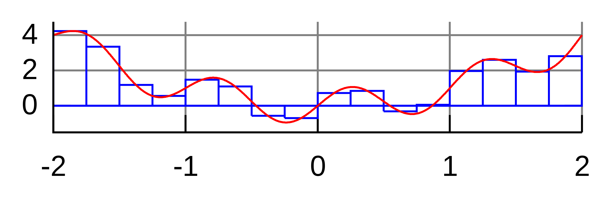
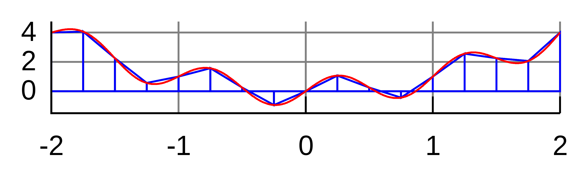
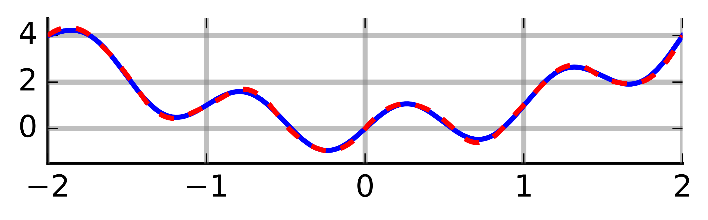

```{r setup, include=FALSE}
knitr::opts_chunk$set(echo = TRUE)
```

Monte Carlo is an omnibus name for computational algorithms in statistics, which rely on repeated random sampling in order to produce numerical results. Major areas of use include

* generating draws from complicated distributions and/or on complicated domains, e.g. extremes or manifolds,
* integral evaluation, e.g. approximations of moments or normalizing constants for densities, and
* optimization, e.g. mode evaluation.

But more generally, the basic idea is as follows: if we are able to generate samples from a complicated process, we can learn many things about the process with precision dictated by the amount of samples we draw. This way, we can sometimes use Monte Carlo to test hypotheses, construct confidence intervals, etc. As such,the name Monte Carlo is often used a synonym for simulation-based statistical techniques.

<a name="MC_ex"></a>
**Example**: Let us return to the first one from the previous chapter, where we observe random sample $(X_1,Y_1)^\top,\ldots,(X_N,Y_N)^\top$ from a bi-variate Gaussian distribution
\[
\mathcal{N}\left(\begin{pmatrix} \mu_1 \\ \mu_2 \end{pmatrix}, \begin{pmatrix} \sigma_1^2 & \rho \\ \rho & \sigma_2^2 \end{pmatrix} \right)
\]
and wish to test $H_0: \rho = \rho_0$ for some fixed value of $\rho_0$. If we are willing to assume that $\rho$ is the only unknown parameter (which happens e.g. when the data come from a standardized distribution with $\mu_1 = \mu_2 = 0$ and $\sigma_1 = \sigma_2 = 1$), we can simulate from the distribution of the empirical estimator $\widehat{\rho} = N^{-1} \sum_{n=1}^N X_n Y_n$ under the null (under the null, we know everything, and hence we can simply draw new data sets) and hence we can use this simulation to calculate the $p$-value for our test. However, in practice, we would likely not have known the nuisance parameters $\mu_1,\mu_2,\sigma_1,\sigma_2$ (the distribution would not have been standardized) and we would have to somehow take care of them (maybe we would standardize the observed data set empirically before continuing). But how can we know whether our $p$-value would still be valid?

The name Monte Carlo refers to a casino in Monaco, where an uncle of one of the method's inventors used to loose a significant amount of money by playing roulette. With a bit of exaggeration, we could say that with every single roll (and his corresponding bet), the uncle learnt a bit more about the fact that the casino always wins in a long run. In the simple case of roulette, everything can of course be calculated directly. But with more complicated processes it can be easier to draw samples and statistically evaluate those, compared to analyzing the processes themselves.

The prerequisite for doing Monte Carlo is being able to draw samples from well-known distributions.

# Random Number Generation

For a mathematician, a *random number* is a realization or a random variable, which is a well-defined concept from measure theory. A random sample is a sequence of independent random numbers coming from the same distribution. Of course, random numbers are hard to obtain from a computer (and it is a philosophical argument whether this is even possible).

Historically, "randomness" was obtained using

* dice
* cards
* coins
* physical processes
* census data
* tables (many created for that purpose, or drawn digits from e.g. logarithmic tables)

A turning point came from the great [John von Neumann](https://en.wikipedia.org/wiki/John_von_Neumann), a father of

* spectral operator theory and Hilbert spaces,
* quantum mechanics, logic, and information theory,
* game theory and mathematical finance,
* linear programming, and
* simulation studies.

John von Neumann advocated that sampling should *not be* random, it should only *appear to be* random by passing certain criteria (pseudo-randomness). In particular, a generated sequence should satisfy

* very accurate approximation to the desired distribution for $N\to \infty$,
* not predictable,
* pass a set of statistical tests for independence (true independence is impossible),
* repeatability ($\Rightarrow$ reproducibility),
* long cycle before it starts repeating itself (today it is most commonly $2^{31}$),
* fast sampling (generate the sequence quickly),
* transferability accross platforms.

Today, algorithms also have to follow strict criteria set by the IEEE Arithmetic Standard. Researchers quickly set their focus specifically on generating such sequences from the uniform distribution, both due to the practical reasons and due to the fact that having a good algorithm for generating random numbers from $U[0,1]$ is all one needs (other distributions can be obtained as transformations).

## The Uniform Distribution on $[0,1]$

It may be surprising that even the *linear congruential method* forming a sequence $\{X_n\}_{n \geq 1}$ by setting
\[ X_{n} = (a X_{n-1} + c) \,\mathrm{mod}\, m, \quad n=1,2,\ldots, \]
where $a,c,m$ and $X_0$ are cleverly chosen fixed numbers, can fulfill the requirements above. The linear congruential method will naturally produce only a finite sequence of numbers before starting to repeat itself. A length of such sequence can however be very large (e.g. $10^{12}$) depending on the choice of the constants, so this is hardly a practical problem.

Actually, the fact that a sequence of numbers appears to be random even though every number in the sequence is a deterministic function of the previous number(s) has one huge advantage: reproducibility. Even though the linear congruential method in its simplest form above is not used, one can think of setting the seed (by `set.seed()` in `R`) as choosing the staring point in the finite sequence produced by the linear congruential method, from which a sub-sequence (the random sample of length $N$ is sampled). At any later point in time, the same sub-sequence can be obtained by using the same generator starting from the same starting point.

While it is beyond the scope of this course to dive any deeper into the base-line pseudo-RNG algorithms, we should keep several points in mind:

* RNG used in statistics in only *pseudo-random*, i.e. it appears to be random, even though it is fully deterministic.
* RNG algorithms are constantly improving. Now, we believe to have a "perfect" algorithm for our purposes provided with our software.
* However, when working with some older software (even older versions of `R` or Matlab), one should be vigilant. (I saw once, in an old version of Matlab, a "pseudo-random" sequence $X_1,\ldots,X_N$ such that the subsequent triplets $(X_1,X_2,X_3)^\top, (X_4,X_5,X_6)^\top, \ldots \in \mathbb{R}^3$ actually laid on a line in $\mathbb{R}^3$.)

```{r,fig.width=12,fig.height=4}
Nsim=10^4 #number of random numbers
x=runif(Nsim)
x1=x[-Nsim] #vectors to plot
x2=x[-1] #adjacent pairs
par(mfrow=c(1,3))
hist(x,main="Histogram")
plot(x1,x2, main="Scatterplot")
acf(x, "Autocovariance Function")
```

## Other Distributions

Now that we know how to generate data from the $\mathcal{U}[0,1]$ distribution (at least for most practical purposes), we can formally use the following result to generate data from any other distribution.

**Lemma.** *(Inverse transform.)* Let $U \sim \mathcal{U}[0,1]$, then for a distribution function $F$ the random variable $X = F^{-1}(U)$ has distribution $F$.

**Proof.** Simply $P(X \leq x) = P(F(X) \leq F(x)) = P(U \leq F(x)) = F(x)$.

The lemma above silently assumes existence of the inverse $F^{-1}$, but the inverse can be replaced by the generalized inverse $F^-(y) = \inf\{x \,|\, F(x) \geq y\}$, and the proof is just slightly more complicated.

While the theorem above seems almighty, it is not. E.g. to generate from $\mathcal{N}(0,1)$, we would need to work with the distribution function of standard normal, which does not have an analytic expression, hence numerical approximation is needed again. Software usually has built-in functions for standard distributions, and they should be used, e.g. `rnorm()` to generate from $N(0,1)$, and those are often based on more simple and efficient transformation relationships between distributions, e.g. $a X + b \sim \mathcal{N}(b,a^2)$ for $X \sim \mathcal{N}(0,1)$. Many other examples are shown on [this diagram](http://www.math.wm.edu/~leemis/chart/UDR/UDR.html), e.g. the standard uniform distribution can be transformed to the exponential distribution from which Laplace, Weibull, or Chi-squared distributions can be easily obtained. Looking carefully at the diagram, one can notice that an important path that is missing is generation of $\mathcal{N}(0,1)$ from $\mathcal{U}(0,1)$. This can be achieved e.g. by using the Box-Muller transform.

**Lemma.** *(Box-Muller transform.)* Let $U_1,U_2 \sim \mathcal{U}(0,1)$ be independent. Then
\[
Z_1 = \sqrt{-2 \log(U_1)} \cos(2\pi U_2) \quad \& \quad Z_2 = \sqrt{-2 \log(U_1)} \sin(2\pi U_2)
\]
are two independent standard Gaussian random variables.

**Proof.** Calculation using the density transformation theorem.

The Box-Muller transform is easy to be implemented, but it may not be the best way to generate from the standard Gaussian since evaluating trigonometric functions is rather expensive. 

## Rejection Sampling

Assume we wish to simulate from a *target* density $f$ and we know how to simulate from a *proposal* density $g$. Assume $f$ and $g$ have the same support (i.e. $\forall x: \,f(x) > 0 \Leftrightarrow g(x) > 0$) and there exists $c \geq 1$ such that $\forall x : \, f(x) \leq c g(x)$. The following algorithm can then be used to draw a sample $X$ from $f$:

1. Draw a proposal $Y$ from $g$.
2. Draw $U \sim \mathcal{U}(0,1)$.
3. If $U  < \frac{1}{c} \frac{f(Y)}{g(Y)}$, accept $X = Y$ and stop, otherwise go back to 1.

In the example of the standard uniform proposal and the beta $\mathcal{B}(2,5)$ target below, it is easy to see that the algorithm works (really generates from the target $f$) and that the probability of stopping in step 3 (the acceptance probability) of the algorithm above is equal to $1/c$.

```{r,echo=F,out.width="40%"}
x <- 1:1000/1001
M <- optimize(f=function(x){dbeta(x,2,5)}, interval=c(0,1),maximum=T)$objective
plot(dbeta(x,2,5),type="l",col="red")
points(rep(M,1000),type="l",col="blue")
```

The acceptance probability is clear even more generally, since we sample the uniform pair $(Y,U)$ from a mass $M$ (the area under $M g(x)$) and accept iff the sample hits the area under $f(x)$, which is one. For validity of the algorithm, note that the outcome $X$ the algorithm is really distributed according to $f$:
\[
\begin{split}
P(X \leq x) &= P\Bigg(Y \leq x \,\Bigg|\, U \leq \underbrace{\frac{1}{c} \frac{f(Y)}{g(Y)}}_{=:t(Y)} \Bigg)
= \frac{P\Bigg(Y \leq x \,\wedge\, U \leq t(Y) \Bigg)}{P\Bigg(U \leq t(Y) \Bigg)}\\
&= \frac{\int^x \int^{t(y)}d u\, g(y) d y}{\int \int^{t(y)}d u\, g(y) d y} 
= \frac{\int^x t(y) g(y) d y}{\int t(y) g(y) d y} = \frac{\int^x \frac{1}{c} f(y) d y}{\int \frac{1}{c} f(y) d y} = \frac{\frac{1}{c} F(x)}{\frac{1}{c}} = F(x),
\end{split}
\]
where $F$ is the distribution function corresponding to the density $f$.

Similarly to the inverse transform method, rejection sampling is quite general and can be used to sample from virtually all distributions (for discrete distributions, one can work with probability mass functions instead of densities; multivariate distributions are can be treated the same), as long as a proposal density can be found. However, it's efficiency is dictated by the how efficiently the target and proposal densities can be evaluated and how high is the acceptance probability $1/c$ (basically we want the target and proposal densities to have a similar shape in order to have a low constant $c \approx 1$.

**Example:** We wish to simulate data from the standard Gaussian target using the doubly exponential proposal, i.e.
\[
f(x) = \frac{1}{\sqrt{2\pi}} e^{-\frac{x^2}{2}} \quad \& \quad g(x) = \frac{\alpha}{2} e^{-\alpha |x|}, \text{ where } \alpha > 0.
\]

In the code below, I use `M` in place of $c$, since `c` is sacred in `R`.

```{r, fig.width=4,fig.height=4, fig.show="hold"}
M <- optimize(f=function(x){dnorm(x)/dexp(abs(x))*2}, interval=c(0,5),maximum=T)$objective

# returns a single accepted sample from standard doubly exp. proposal and N(0,1) target
acc_rej_dexp_norm <- function(M,a,b){
  U <- runif(1)*M
  sings <- c(-1,1)
  Y <- rexp(1)*sample(sings,1) # doubly exponential
  while (U>dnorm(Y)/dexp(abs(Y))/2/M){
    U <- runif(1)*M
    Y <- rexp(1)*sample(sings,1)
  }
  return(Y)
}

x <- 1:5000/1001
plot(c(-rev(x),x),M*c(rev(dexp(x))/2,dexp(x)/2),type="l",col="blue",xlab="",ylab="",
     main="Target and scaled proposal densities")
points(c(-rev(x),x),c(rev(dnorm(x)),dnorm(x)),type="l",col="red")

set.seed(517)
N <- 1000
X <- rep(0,N)
for(n in 1:N){
  X[n] <- acc_rej_dexp_norm(M,a,b)
}
plot(density(X),col="red",main="KDE plots from simulated data")
points(density(rnorm(N)),type="l")
```

The example above provides another way of generating from the standard Gaussian:
\[
\mathcal{U}[0,1] \longrightarrow Exp(1) \longrightarrow DoublyExp(1) \longrightarrow N(0,1)
\]
where the arrows correspond to transpormations:

* first arrow is a log-transform,
* second arrow is simple, see the code above,
* third arrow is the rejection algorithm above.

`R` actually uses neither Box-Muller nor the rejection approach from the doubly exponential proposal. Instead it uses the inverse transform, searching through the values of $F^{-1}$, which are tabulated to a very high precision in the case of standard Gaussian.

# Numerical Integration

## Deterministic Approaches

Numerical integration (of definite integrals) is an important problem and correspondingly large area of research. The most well-known and simplest deterministic method, called the *quadrature* method, amounts to calculating Riemann sums, i.e. evaluating the function on a grid $t_1,\ldots,t_K$ and approximating
\[
I = \int_a^b f(x) d x
\]
by $S_K = K^{-1} \sum_{k=1}^K f(t_k)$. As $K\to \infty$, $S_K \to I$ (for a reasonable $f$). Actually, the formula for $S_K$ above corresponds to integrating locally constant interpolation of $f$ based on $f(t_1),\ldots,f(t_K)$. Of course, we can do smarter than local constant:

* local linear interpolation leads to the *trapezoidal rule*,
* local quadratic interpolation leads to the *Simpson's rule*.

```{r, echo=F, out.width='30%', fig.align="center", fig.show="hold", fig.cap="Figure: Riemann sum, trapezoidal rule, and Simpson's rule. Simpson's rule is missing the grid, sorry about that -- imagine that there is the same grid as on the first two plots, and the function is approximated quadratically between every two neighboring grid points. Source: wiki."}



```

## Naive Monte Carlo

The naive Monte Carlo basically replaces the deterministic grid with a random one: $N$ samples $X_1,\ldots,X_N$ are drawn from $\mathcal{U}[a,b]$ distribution and
\[
I = \E\big[ f(U) \big]
\]
is approximated stochastically by $\widehat{I}_N = N^{-1} \sum_{n=1}^N f(X_n)$. Due to the law of large numbers, $\widehat{I}_N \to I$ almost surely. Compared to the deterministic approaches, Monte Carlo has the advantage of easy convergence monitoring: $\widehat{I}_N$ is a random variable arising as a mean of i.i.d. random variables. It is unbiased and its variance can be naturally estimated as $v_n$ below. Hence by the central limit theorem we have
\[
\sqrt{N}\frac{\widehat{I}_N - I}{v_N} \stackrel{\cdot}{\sim} \mathcal{N}(0,1) \,, \quad \text{where} \quad v_N = \frac{1}{N} \sum_{n=1}^N \big[ f(X_n) - \bar{f}_N \big]^2
\]
from which confidence intervals can be constructed and convergence checked, provided the variance exists and converges fast enough (which is not always the case). Although constructions of CIs this way is often very useful, one has to be careful about *silent failure*. When e.g. $f$ explodes on a very small sub-interval of $[a,b]$ and we have no samples on this sub-interval, the CIs will be overly optimistic. Basically if the sampling regime misses an important pattern, the variance estimate and hence CI will miss it too, so we may be overly confident in a wrong result. 

There are other problems with the simple approaches above. They struggle with unbounded domains (often failing to find the important areas) and they are prone to the curse of dimensionality in the case of multivariate integrals. Both of these are quite common in statistics.

## Importance sampling

The typical situation in which Monte Carlo overcomes the aforementioned problems and outshines deterministic approaches is when sampling can be custom-tailored to the integrand. We can write
\[
I := \int_\mathcal{X} f(x) d x = \int_\mathcal{X} \frac{f(x)}{g(x)} g(x) d x =
\E_g \left[ \frac{f(X)}{g(X)} \right].
\]
Now sampling $X_1,\ldots,X_N \sim g$, we can approximate $I$ by 
\[
\widehat{I} := \frac{1}{N}\sum_{n=1}^N \frac{f(X)}{g(X)}.
\]
We still have from the law of large numbers that $\widehat{I} \stackrel{a.s.}{\to} I$ and can construct CIs from the limiting distribution provided by CLT. Notice that the asymptotic variance of $\widehat{I}$ is
\[
\mathrm{avar}\big(\widehat{I}\big) = \frac{1}{N} \int_\mathcal{X} \left( \frac{f(x)}{g(x)} -  \E_g \left[ \frac{f(X)}{g(X)} \right] \right)^2 g(x) d x.
\]
In particular, the variance is zero if $f(x)/g(x) = 1$ on the domain $\mathcal{X}$, and is small if $f/g$ is approximately constant on $\mathcal{X}$.

Intuitively, if we integrating a very flat function, i.e. if all regions of the domain are of equal importance, very few samples suffice to have a good approximation. This is of course true also for the deterministic approaches. But the great advantage of Monte Carlo is that we can incorporate different importance of different regions of the domain into the sampling scheme (and hence the name *importance sampling*).

In statistical applications, we are often interested directly in the integrals of the form
\[
\E_g \big[ f(X) \big] = \int_\mathcal{X} f(x) g(x) d x
\]
and if simulation from $g$ is readily available, we can proceed as above. If simulation from $g$ is difficult, we can change the reference (probability) measure from $g$ to some $h$
\[
\E_g \big[ f(X) \big] = \int_\mathcal{X} f(x) \frac{g(x)}{h(x)} h(x) d x = \E_h \left[ f(X) \frac{g(X)}{h(X)} \right]
\]
and simulate from $h$ instead.

Hence we have a lot of freedom how to sample (i.e. how to choose the reference measure), but there is a certain trade-off: we want to

* have the integrand as flat as possible
* be able to simulate from the reference measure efficiently

When $\mathcal{X} = \R$, it is important to match the decay of the tails between the target and reference measures. This is the case for both rejection and importance sampling schemes, and it makes them practically not that useful in more complicated examples (where the tail behavior might not even be known).

*Note*: We also have to be careful when changing measure to always cover the whole domain $\mathcal{X}$; we cannot use e.g. $\mathcal{U}[a,b]$ as the new reference measure when $\mathcal{X} = \R$. Typically (as shown in the examples below), we are in the opposite situation: we typically have means to sample from a larger domain than $\mathcal{X}$, and samples outside of $\mathcal{X}$ are rejected. Be careful about standardization of your results in that case.

**Example:** Approximately calculate $P(2 < X < 6)$ for the target distribution $X \sim f$ using a reference $g$ for

* Gaussian target, Exponential Reference
* Cauchy target, Exponential Reference
* Cauchy target, Gaussian Reference

```{r,out.width="30%",fig.show='hold',fig.align='center',fig.cap="Gaussian target, Exponential reference - densities (left), their ratio (middle), importance sampling error (right)."}
op <- par(ps=30)
x <- 6*(1:1000)/1001
plot(x,dnorm(x),type="l",ylab="")
points(x,dexp(x),type="l",col="blue")
abline(v=c(2,6),lty=2)

plot(x,dnorm(x)/dexp(x),type="l",ylab="")
abline(v=c(2,6),lty=2)

set.seed(696)
x=rexp(10^5)
wein=dnorm(x)/dexp(x)
# boxplot(wein/sum(wein))
plot(log10(1:10^5),cumsum(wein*(x>2)*(x<6))/cumsum(rep(1,10^5)),type="l",ylim=c(0,0.05),xlab="log(N)",ylab="")
abline(a=pnorm(6)-pnorm(2),b=0,col="sienna")
```

```{r,echo=F,out.width="30%",fig.show='hold',fig.align='center',fig.cap="Cauchy target, Exponential reference - densities (left), their ratio (middle), importance sampling error (right)."}
op <- par(ps=30)
x <- 6*(1:1000)/1001
plot(x,dcauchy(x),type="l",ylab="")
points(x,dexp(x),type="l",col="blue")
abline(v=c(2,6),lty=2)

plot(x,dcauchy(x)/dexp(x),type="l",ylab="")
abline(v=c(2,6),lty=2)

set.seed(696)
x=rexp(10^5)
wein=dcauchy(x)/dexp(x)
# boxplot(wein/sum(wein))
plot(log10(1:10^5),cumsum(wein*(x>2)*(x<6))/cumsum(rep(1,10^5)),type="l",ylim=c(0,0.3),xlab="log(N)",ylab="")
abline(a=pcauchy(6)-pcauchy(2),b=0,col="sienna")
```

```{r,echo=F,out.width="30%",fig.show='hold',fig.align='center',fig.cap="Cauchy target, Gaussian reference - densities (left), their ratio (middle), importance sampling error (right)."}
op <- par(ps=30)
x <- 6*(1:1000)/1001
plot(x,dcauchy(x),type="l",ylab="")
points(x,dnorm(x),type="l",col="blue")
abline(v=c(2,6),lty=2)

plot(x,dcauchy(x)/dnorm(x),type="l",ylim=c(0,10),ylab="")
abline(v=c(2,6),lty=2)

set.seed(491)
x=rnorm(10^5)
wein=dcauchy(x)/dnorm(x)
# boxplot(wein/sum(wein))
plot(log10(1:10^5),cumsum(wein*(x>2)*(x<6))/cumsum(rep(1,10^5)),type="l",ylim=c(0,0.3),xlab="log(N)",ylab="")
abline(a=pcauchy(6)-pcauchy(2),b=0,col="sienna")
```

# Variance Reduction

As exemplified above in the case of importance sampling, accuracy of Monte Carlo integration can be assessed by the asymptotic variance (the theoretical one). One of the clear advantages of Monte Carlo integration is that this variance can be estimated by its sample version, which gives us some information about how confident we can be in the obtained results, and hence gives us the means to decide when to stop simulating (iterating) and become satisfied with our current result. The choice of the proposal function should be such that the asymptotic variance is as small as possible. This is just one (though clearly the most important, at least for statistics) example of a variance reduction technique. Other variance reduction techniques include

* correlated sampling
    - Example: Say we want to estimate $\E Z$ with $Z = X - Y$. We can sample independently $X_1,\ldots,X_N$ and $Y_1,\ldots,Y_N$, form $Z_n = X_n - Y_n$ for $n=1,\ldots,N$, and estimate $\E Z$ empirically as $N^{-1} \sum Z_n$. The variance of this estimator is governed by $\mathrm{var}(Z_n) = \mathrm{var}(X_n) + \mathrm{var}(Y_n) - 2 \mathrm{cov}(X_n,Y_n)$, where the covariance is normally 0 since $X$'s and $Y$'s are drawn independently. Instead, if we alter the sampling such that $\mathrm{cov}(X_n,Y_n) > 0$, we reduce the sampling variance of our estimator.
* quasi-random sampling
    - Example: Say we wish to approximate $\int_0^1 f(x) d x$. Instead of sampling $X_1,\ldots, X_N$ uniformly on $[0,1]$, we could take a regular grid $t_1,\ldots,t_K$ and introduce randomness by taking $X_{k,j} := t_k + U_j \text{ mod } 1$ where $U$'s are sampled uniformly on $[0,1]$. The empirical estimator based on locations $X_{k,j}$ can have reduced variance.
    - The example above is an oversimplification, in practice different quasi-random sequences are used (e.g. the [Sobol sequence](https://en.wikipedia.org/wiki/Sobol_sequence)), which are guaranteed to result in faster convergence rates, depending on the smoothness of $f$.
* and many other techniques such as, stratified sampling, control variates, or multi-level sampling

The take-home message of the correlated sampling example above is that when evaluating several different estimators/methods via simulations, the same simulated data sets should be used for all the estimators/methods. For example, assume we are performing a small simulation study to try which of two location estimators is better for a sample $W_1,\ldots,W_N \sim \mathcal{N}(\mu,1)$:
\[
\widehat{\mu}_1 = \frac{1}{N}\sum_{n=1}^N W_n \quad \text{or} \quad \widehat{\mu}_2 = \frac{1}{\sum_{n=1}^N \mathbb{I}_{[|W_n| \leq 3]}}\sum_{n=1}^N W_n \mathbb{I}_{[|W_n| \leq 3]},
\]
i.e. the first estimator is the standard empirical mean, while the second estimator discards outliers and calculates empirical average of the remaining data points. Of course, we know that the empirical mean is a superior estimator in this case (at least w.r.t. the squared loss, since the data are assumed Gaussian), but how do we verify it via simulations? For different values of $\mu$ and for $b=1,\ldots,B$, we generate a data set $W_1^b,\ldots,W_N^b$, we calculate the estimators, and then calculate the loss of the estimators. Schematically:
\[
\begin{eqnarray}
W_1^b,\ldots,W_N^b &\Rightarrow& \widehat{\mu}_1^b \Rightarrow X_b &=& ( \widehat{\mu}_1^b - \mu)^2 \\
W_1^b,\ldots,W_N^b &\Rightarrow& \widehat{\mu}_2^b \Rightarrow \,Y_b &=& ( \widehat{\mu}_2^b - \mu)^2
\end{eqnarray}
\]
Notice how in every simulation, we drew only one sample. We didn't even thing of generating $\widetilde W_1^b,\ldots,\widetilde W_N^b$ independent of $W_1^b,\ldots,W_N^b$ and using the following scheme:
\[
\begin{eqnarray}
\widetilde W_1^b,\ldots,W_N^b &\Rightarrow& \widehat{\mu}_1^b \Rightarrow X_b &=& ( \widehat{\mu}_1^b - \mu)^2 \\
\widetilde W_1^b,\ldots,W_N^b &\Rightarrow& \widehat{\mu}_2^b \Rightarrow \,Y_b &=& ( \widehat{\mu}_2^b - \mu)^2 .
\end{eqnarray}
\]
While generating two different samples in every simulation run would also work, it would introduce an unnecessary variability into our simulation and increase the variance of $Z_b = X_b - Y_b$ (which is ultimatly the variable we are interested in - we want to know whether $\E Z_b$ is smaller or greater than 0), because clearly $\mathrm{cov}(X_b,Y_b) > 0$. But it could be the other way around with different estimators. For example, consider replacing $\widehat{\mu}_2$ by
\[
\widehat{\mu}_2 = \frac{1}{\sum_{n=1}^N \mathbb{I}_{[|W_n| > 3]}}\sum_{n=1}^N W_n \mathbb{I}_{[|W_n| > 3]}.
\]
Then, it should intuitively be $\mathrm{cov}(X_b,Y_b) < 0$ (because $\widehat{\mu}_1$ performs well when there is few outliers, while $\widehat{\mu}_2$ would perform well with many outliers), so it would probably be better to evaluate the estimators on independent samples. However, the latter $\widehat{\mu}_2$ is a poor estimator. Usually, the correlation between estimators is positive and we should always evaluate different methods on the same data.

# References

Donald Knuth (1997, 3rd ed.) *The Art of Computer Programming*, volume 2

Robert \& Casella (2010) *Introducing Monte Carlo methods with R*
