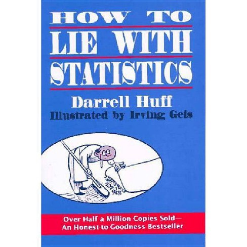
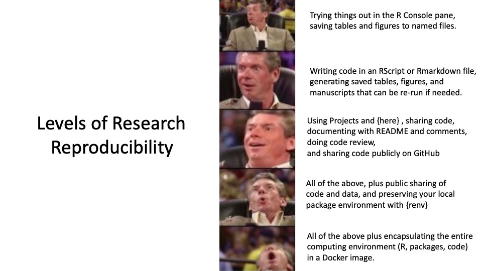

```{r setup, include=FALSE}
knitr::opts_chunk$set(echo = FALSE)
library(bookdown)
library(tidyverse)
theme_set(theme(text=element_text(size=20)))
```

# Last Week's Leftovers

## Our Workflow

* open RStudio (specifically your `StatComp-123456.Rproj` project)

* load some packages

* work in a (R Markdown) script

* save your progress

* push your changes to GitHub

\bigskip

[Bookdown](https://bookdown.org/) -- a lot of interesting books written in R Markdown, including one of the references for this course, the [R for Data Science](https://r4ds.had.co.nz/index.html) book co-authored by Hadley Wickham.

## Good Coding Practices

* consistency (following a certain style)
* indentation
* naming conventions -- short but informative variable/function names  
  - `camelCase`
  - `snake_case` -- my personal preference
  - `dot.case` -- not bad, but some languages will not allow it
  - others such as `PascalCase` or `kebab-case` are inferior
* simplicity
* comments (more the merrier!)
* load packages at the top
* loading data comes next (possibly in a separate script)
* functions come next (possibly in a separate script)
* use `set.seed()` if RNG present
* re-run with empty environment

# Reproducibility

## Job of a Statistician

* think about uncertainty
* estimate variation ($\Rightarrow$ confidence intervals, significance)
* avoid bias (not entirely possible, but anticipate and reduce it)
* build models emulating nature
  - inference about the models leads to conclusions about nature -- but what if the model is a poor emulation of nature?
* provide *interpretable* models allowing for rational conclusions
  - prediction vs. information extraction
  - all models are wrong $\Rightarrow$ critical model validation
* draw conclusions from data
  - this is rather vague since almost everything is data
* traditional role: statisticians invited to analyze existing data
  - problems such as: does the existing data set contain the desired information?
* modern role: collaborative step-by-step
  - from acquisition of data to presentation of results
  - interdisciplinary communication
* exploratory vs. confirmatory analysis

## Cycle of (Data-driven) Science

```{r, out.width='70%', fig.align='center'}
knitr::include_graphics('../Plots/data_science_cycle.png')
```
\hfill \footnotesize \textcolor{gray}{credit: Bin Yu, Rebecca Barter}

## Domains of Application

- actuarial science
- biostatistics (medicine, pharma, genetics, etc.)
- business
- chemometrics
- econometrics
- epidemiology
- finance
- geostatistics
- machine learning and AI
- official statistics (demography, surveys, etc.)
- psychology
- quality control
- reliability
- physics
- signal processing
- ...

## Statistics in Science

An overwhelming portion of contemporary scientific conclusions is based on the concept of *statistical significance*:

* there is a hypothesis (e.g. drug A is better than drug B)
* data is collected (e.g. patients are split, some are given drug A, others drug B, and some relevant response $Y$` is collected)
* null hypothesis is formed (e.g. "effect A on $Y$ > effect B on $Y$")

  - this usually requires a model

* if p-value < 5 %, conclusion is reached

Problems:

  - was there really a hypothesis at the beginning?
  - how exactly were data collected?
  - is the model good? (confounders?)
  - the "if" above
  
## Shady Practices I

* from chapter titled "Writing the Empirical Journal Article" a popular [career guide](https://www.apa.org/pubs/books/4316014) in psychology:

&nbsp;

> "There are two possible articles you can write: (1) the article you planned to write when you designed your study or (2) the article that makes the most sense now that you have seen the results. They are rarely the same, and the correct answer is (2). [...] If you see dim traces, try to reorganize [...] Go on a fishing expediction for something, anything..."

* this is called $p$-hacking and should be avoided!

## Shady Practices II

* Carney, Cuddy & Yap (2010) Power Posing: ...
    - ... has positive effects on your mind
* Cuddy (2012) Your body language may shape who you are, [TED talk](https://www.ted.com/talks/amy_cuddy_your_body_language_may_shape_who_you_are?language=en)
    - 2nd most viewed TED talk of all time
* 2015 first reproducibility issues
* 2016 Carney withdraws her name
    - she no longer believes in the effect, because
    
&nbsp;
    
> We ran subjects in chunks and checked the effect along the way. It was something like 25 subjects run, then 10, then 7, then 5. Back then, this did not seem like p-hacking. It seemed like saving money.

* this is called peeking (at $p$-values) and should be avoided! (or admitted and corrected for)

## Example of Peeking

```{r,echo=T}
peeking <- function(a=25,b=10){
  x <- rnorm(25)
  Tstat <- mean(x)/sd(x)*sqrt(length(x))
  if(abs(Tstat) > qt(0.975,length(x)-1)){
    return(Tstat)
  }else{
    x <- append(x, rnorm(b))
    Tstat <- mean(x)/sd(x)*sqrt(length(x))
    return(Tstat)
  }
}
set.seed(517)
Tstats <- sapply(1:10000,peeking)
mean(I(abs(Tstats) > qnorm(0.975)))
```

## R code explained

\footnotesize
* `<-` is the preferred assignment operator
  - \footnotesize while `<-` $\equiv$ `=`, assignment is such a crucial operation it should not be confused with a mathematical/logical operator
* function is an object, like a variable, just of a different class
  - \footnotesize `f_name <- function(params){ f_body }` defines your own function
* univariate distributions are defined by functions named as `[x][distr_name]` where
  - \footnotesize `x` $\in$ $\{$ `d`, `p`, `q`, `r` $\}$, standing for `d`ensity, `p`robability distribution function, `q`uantile function, `r`undom number generation
  - \footnotesize `distr_name` specifying distribution such as `unif`, `norm` (Gaussian), `t` (Student's t), `exp`, `binom`, `gamma`, `beta`, `cauchy`
  - \footnotesize e.g. `rnorm()` is random number generation from a Gaussian, `qt()` is a quantile function of the t distribution
* other pre-defined functions used on the previous slide include
  - \footnotesize `mean()` and `sd()` are the empirical mean and standard deviation of a vector
  - `length()` gives length of a vector
  - `I()` a bit special and actually useless on the previous slide, I just like to think of it as an indicator: `I(a > b)` $\equiv$ `a > b` and it returns `TRUE` iff `a` is greater than `b` (when `a` and `b` are vectors, it returns a vector of `T/F`)
* `?f_name` shows help for a function
* `return()` is not a function, it is part of the function syntax, specifying what should the function return upon call
  
## Reproducibility Crisis

* a meta-analysis confirms only 37 % out of 97 % significant results published in psychology  
  -- Open Science Collaboration (2015) Estimating the Reproducibility of psychological science. *Science*

* similar issues in other fields, e.g. [biology](https://elifesciences.org/articles/04333), [chemistry](https://www.nature.com/articles/548485a), [economics](https://doi.org/10.3386/w22989),
[social sciences](https://www.nature.com/articles/s41562-018-0399-z?iOS=), or [nutrition](https://academic.oup.com/ajcn/article/97/1/127/4576988?login=false) (Is everything we eat cancer?)
  - we are talking even about *Nature* and *Science* publications not being reproducible!
  
* it is *not* the fault of $p$-values
  
## More on Shady Practices

```{r, out.width='40%', fig.align='center'}

```

&nbsp;

\pause
> "Ironically, written by a journalist with little knowledge of statistics who later accepted thousands of dollars from cigarette companies and told a congressional hearing in 1965 that inferences in the Surgeon General's report on the dangers of smoking were fallacious." -- Andrew Gelman

## Reproducible Research

* sharing data (and code)
* documenting data collection/cleaning and analyses
  - in particular any judgement calls (mostly data cleaning and modeling choices, but sometimes also tuning parameter selection, etc.)

&nbsp;

* encapsulation

&nbsp;

* pre-registration
* publishing negative results

## Reproducible Data Analysis

```{r, out.width='100%', fig.align='center'}

```

# Ethics

## Ethical Guidelines for Statistical Practice

* Professional Integrity and Accountability
  - expose yourself to (self-)criticism
* Integrity of Data and Methods
  - aim for reproducibility
* Responsibilities to Stakeholders
* Responsibilities to Research Subjects
  - research on living beings must be supervised
  - privacy for human subjects
* Multidisciplinary Teams
  - profession-specific ethical guidelines
* Responsibilities to the Statistical Profession, Mentoring, etc.
  - the career guide above fails big here

# Data Exploration

## Data Set I

\footnotesize
```{r, echo=T, warning=F}
library(faraway)
data(chredlin) # attaches the data into the global env
head(chredlin)
```

## Data Frame

```{r, out.width='100%', fig.align='center'}
knitr::include_graphics('../Plots/data_frame.png')
```

## Base R

\footnotesize
```{r, echo=T, out.width='75%'}
plot(x = chredlin$race, y = chredlin$involact)
```


## `tidyverse`

`tidyverse` is a bundle of R packages (itself a package) that allow for modern data manipulation and visualization

\footnotesize
```{r, echo=T, eval=F}
library(tidyverse)
```

## `ggplot2`

\footnotesize
```{r, echo=T, out.width='75%',message=F}
ggplot(data = chredlin, mapping = aes(x = race, y = involact)) +
  geom_point() # adds a layer to the empty plot above
```

## `ggplot2`

\footnotesize
```{r, echo=T, out.width='75%',message=F}
ggplot(data = chredlin, mapping = aes(x = race, y = involact)) +
  geom_point() + # adds a layer to the empty plot above
  stat_smooth(method="lm") # adds a regression line too
```

## `tidyverse` verbs

The basic verbs (functions) which will allow us to do most of the data manipulation tasks are

* `filter()` picks observations by chosen values
  - `select()` picks variables (by their names), hence is a poor "transpose" of `filter()`
* `mutate()` creates new variables as functions of existing ones
* `arrange()` orders the observations
* `group_by()` allows all of the above to work locally
  - `summarize()` collapses values down to a single summary -- only useful together with `group_by()`
  
## Data Set II

\tiny
```{r,echo=T,warning=F,message=F}
library(data.table)
```
```{r, echo=T}
flights <- fread("https://raw.githubusercontent.com/Rdatatable/data.table/master/vignettes/flights14.csv")
### flights have 1/4 million rows, so subsample
# flights <- flights[sample(1:dim(flights)[1], 5000),] # base R version of sub-sampling
flights <- flights %>%
  slice_sample(n=5000)                               # tidyverse version of sub-sampling
head(flights)
```

## Drop (Non-numerical) Variables

\footnotesize
```{r, echo=T}
flights <- select(flights, -carrier, -origin, -dest)
head(flights)
```

* above is `tidyverse` function/verb `select`, but used in a base R syntax
* `tidyverse` pairs well with **piping** operator `%>%` defined by to make the following equivalent:
  - `f(x,y)` \hfill $\ldots$ \hfill `select(flights, -carrier)`
  - `x %>% f(y)` \hfill  $\ldots$ \hfill  `flights %>% select(-carrier)`
  
* piping can be chained -- we are always operating on the data!
  - `g(f(x,y),z)` is equivalent to
  - `x %>% f(y) %>% g(z)`

## Example

Say the goal is 

* to look at some flights that took place on 1st April
* having the variables that should be factors transformed into factors

\footnotesize
```{r, echo=T}
flights <- fread("https://raw.githubusercontent.com/Rdatatable/data.table/master/vignettes/flights14.csv")
flights %>% 
  filter(month ==4, day == 1) %>%
  mutate(carrier = as.factor(carrier),
          origin = as.factor(origin),
            dest = as.factor(dest)) %>%
  head()
```

## Variable Types

5 basic data types:

* numeric
* integer
* character
* logical
* complex

5 basic data structures:

* array
  - vector $\quad\ldots\quad$ `c(1,2,3)` $\equiv$ `1:3`
  - matrix $\quad\ldots\quad$ `matrix(some_vector, ncol=2)`
* data frame -- `tidyverse` has instead `tibble`
* factor
* list

```{r, echo=T,eval=F}
c(1,"me","you","me",2,3,1,1) %>%
  as.factor() %>% levels() %>% length()
```

## Common Variable Transformations

* `log(x, base)` and `exp(x,base)`
* `x^power` or `sqrt(x)`
* `sin(x)`, `cos(x)` and other trigonometric functions
* `sign(x)`
* Box-Cox transform $y_{n}^{(\lambda)} = \begin{cases} \frac{y_n^\lambda-1}{\lambda} \quad\text{ if } \lambda \neq 0 \\ \log(y_n) \text{ if } \lambda=0 \end{cases}$
  - only used for the response variable in a linear model (good $\lambda$ estimated by profile likelihood)
  - `boxcox(model)` in R, where `model <- lm(...)`

## Examples of Transformations

```{r, echo=T}
flights <- flights %>%
  mutate(late_flag = as.factor(sign(arr_delay)),
         arr_delay_sqrt = sqrt(abs(arr_delay)),
         arr_delay_log = log(1+abs(arr_delay)))
flights %>%
  select(late_flag,arr_delay_sqrt,arr_delay_log)%>%
  str()
```

## Line Plot

* there needs to be a linearly ordered variable, typically time
```{r, echo=F, out.width='70%', fig.align='center', warning=F}
# this is for most parts a lazy and wrong way of manipulating the data, ideally one should transform the poorly formatted `covid` data frame into a better formatted one using `tidy` syntax and not discarding any information
covid <- read.csv("https://raw.githubusercontent.com/CSSEGISandData/COVID-19/master/csse_covid_19_data/csse_covid_19_time_series/time_series_covid19_confirmed_global.csv")
my_dat <- covid[,-(1:4)] %>% as.matrix() %>% t() %>% as.data.frame()
names(my_dat) <- covid$Country.Region
my_dat$date <- seq(as.Date("2022-01-20"), by="1 day", length.out=dim(my_dat)[1])

my_dat %>% select(date, Czechia, Germany, Italy, Switzerland) %>% 
  pivot_longer(-date) %>%
  ggplot(aes(x=date, y=value, colour=name)) +
    geom_line() +
    ggtitle("Cumulative no. of covid cases.")
```

## Bar Plot

```{r, echo=T, out.width='70%', fig.align='center'}
ggplot(data = flights) + 
  geom_bar(mapping = aes(x = carrier)) +
  theme(text = element_text(size = 25))
```

## Bar Plot

```{r, echo=T, out.width='70%', fig.align='center'}
ggplot(data = flights) + 
  geom_bar(mapping = aes(x = carrier, fill = origin)) + 
  theme(text = element_text(size = 25))
```

## Histogram

```{r, echo=T, out.width='70%', fig.align='center', message=F}
ggplot(data = flights) + 
  geom_histogram(mapping = aes(x = arr_delay_log),
                 color="white")
```

## Histogram

```{r, echo=T, out.width='70%', fig.align='center', message=F}
ggplot(data = flights) + 
  geom_histogram(aes(x = arr_delay_log, fill=origin),
                 color="white")
```

## Histogram

\footnotesize
```{r, echo=T, out.width='70%', fig.align='center', message=F}
ggplot(data = flights) + 
  geom_histogram(aes(x = arr_delay_log, y=..density.., fill=origin),
                 position='identity', alpha=0.5, color="white")
```

## Scatterplot

\footnotesize
```{r, echo=T, out.width='70%', fig.align='center'}
ggplot(data = chredlin,
       mapping = aes(x = race, y = involact, color = side, shape = side)) +
  geom_point() + scale_color_manual(values = c("blue","red")) +
  scale_shape_manual(values = c(1,2))
```

## Scatterplot with Regression Lines

\footnotesize
```{r, echo=T, out.width='70%', fig.align='center',message=F}
ggplot(data = chredlin, mapping = aes(x = race, y = involact,
                                      shape = side, color = side)) +
  geom_point() + # adds a layer to the empty plot above
  stat_smooth(method=lm) # adds a regression line too
```

## Plot by Factor

\footnotesize
```{r, echo=T, out.width='70%', fig.align='center', message=F}
ggplot(data = chredlin, mapping = aes(x = fire, y = involact,
                                      shape = side, color = side)) +
  geom_point() +
  stat_smooth(method=lm) +
  facet_wrap(~ side) # split by a value of a factor
```

## Plot by Two Factors

```{r, echo=T, out.width='60%', fig.align='center', message=F}
flights %>%
  filter(carrier %in% c("AA", "UA", "DL", "US")) %>%
  ggplot(mapping = aes(x = dep_delay, y = arr_delay)) +
  geom_point() + stat_smooth(method=lm) +
  facet_grid(origin ~ carrier)
```

## Boxplot

```{r, echo=T, out.width='60%', fig.align='center', message=F}
flights %>%
  filter(carrier %in% c("AA", "B6", "DL", "EV")) %>%
  ggplot(mapping = aes(y = arr_delay_log)) +
  geom_boxplot()
```

## Boxplot by Factor

```{r, echo=T, out.width='70%', fig.align='center', message=F}
flights %>%
  filter(carrier %in% c("AA", "B6", "DL", "EV")) %>%
  ggplot(mapping = aes(x = carrier, y = arr_delay_log)) +
  geom_boxplot()
```

## Boxplot by Two Factors

```{r, echo=T, out.width='60%', fig.align='center', message=F}
flights %>%
  filter(carrier %in% c("AA", "B6", "DL", "EV")) %>%
  ggplot(mapping = aes(x = carrier, y = arr_delay_log,
                       fill = origin)) +
  geom_boxplot()
```

## Heatmaps

\footnotesize
```{r, echo=T, out.width='80%', fig.align='center', message=F}
new_dat <- flights %>% 
  group_by(month, day) %>%
  summarize(count = mean(dep_delay)) %>%
  pivot_wider(names_from = day, values_from = count) %>%
  ungroup() %>% select(-month)
library(lattice)
levelplot(t(as.matrix(new_dat)))

new_dat <- flights %>%
  group_by(carrier)
```

## QQ plot

```{r, echo=T, out.width='80%', fig.align='center', message=F, warning=F}
library(qqplotr)
set.seed(517)
mydat <- data.frame(light_tail = runif(100),
                    heavy_tail = rt(100,df=3),
                    skewed_right = rexp(100),
                    skewed_left = -rexp(100))
myqqplot <- function(myvar){
  mydat %>%
    ggplot(mapping = aes_string(sample = myvar)) +
    stat_qq_point() + # reference Gaussian by default
    stat_qq_line() +
    stat_qq_band() +
    labs(x = "Theoretical Quantiles", y = "Sample Quantiles")
}
```

## QQ Plot

```{r, echo=T, out.width='40%', fig.align='center', fig.show='hold', message=F}
myqqplot("light_tail"); myqqplot("heavy_tail")
myqqplot("skewed_right"); myqqplot("skewed_left")
```

## PP plot

\footnotesize
```{r, echo=T, out.width='50%', fig.align='center', message=F}
mydat %>%
    ggplot(mapping = aes(sample = skewed_right)) +
    stat_pp_band() +
    stat_pp_line() +
    stat_pp_point() +
    labs(x = "Theoretical Cumulative Probability",
         y = "Empirical Cumulative Probability")
```

## PP plot

\footnotesize
```{r, echo=T, out.width='45%', fig.show='hold', fig.align='center', message=F}
mydat %>%
    ggplot(mapping = aes(sample = skewed_right)) +
    stat_pp_band(detrend=T) +
    stat_pp_line(detrend=T) +
    stat_pp_point(detrend=T) +
    labs(x = "Theoretical Cumulative Probability", y = "Empirical")
x <- seq(0,5,by=0.1)
plot(x,dexp(x),type="l")
points(x,dnorm(x,mean(mydat$skewed_right),sd(mydat$skewed_right)),type="l")
```

## Final Remarks

* principal component analysis (PCA) and clustering can be helpful for exploration
  - both PCA and clustering part of the MATH-444 Multivariate Statistics class
  
* exploratory vs. explanatory analysis/graphics
  - exploratory $\ldots$ helps you understand the patterns
  - explanatory $\ldots$ designed to communicate your understanding

## Exercises - Part I

1. Freedman (2009) Statistical Models, Example 4, p. 75:    
Suppose $Y$ consists of 100 independent $\mathcal{N}(0,1)$ random variables. This is pure noise. Let $X \in \mathbb{R}^{100 \times 50}$ be the design matrix with independent $\mathcal{N}(0,1)$ variables (just more noise). We regress $Y$ on $X$ (i.e. no intercept). The coefficient of determination $R^2$ will be about 50/100=0.5. Suppose we test each of the 50 coefficients at the 10 % level and keep only the "significant" variables. There will be about $50 \times 0.1 = 5$ keepers (just by chance). Running the regression on the keepers only (again, without intercept), we are likely to get a decent $R^2$ (like 0.2 -- decent by the social-science standards) and dazzling $t$-statistics. Run a couple of simulations and see for yourself.

2. The "Example of Peeking" above is an example of a small simulation study, checking whether a designed test strategy respects the nominal level $\alpha = 0.05$ or not. Incorporate further levels of peeking in order to mimic the power-posing study.

## Exercises - Part II

3. For one of the two exercises above:
  - write down your results in R Markdown
  - produce an HTML report
  - push both the `.Rmd` and `.html` files to your GitHub repo
  - replace your Moodle submission for Assignment one with the (clickable) link to the HTML file (as described in the course requirements)

## References

* Poldrack (2019) [Statistical Thinking for the 21st Century](https://statsthinking21.github.io/statsthinking21-core-site/index.html)

* [JASA Ethical Guidelines for Statistical Practice](https://www.amstat.org/your-career/ethical-guidelines-for-statistical-practice)

* Gelman (2018) [Ethics in statistical practice and communication](https://rss.onlinelibrary.wiley.com/doi/full/10.1111/j.1740-9713.2018.01193.x)

* Wickham & Grolemund (2017) [R for Data Science](https://r4ds.had.co.nz/index.html)