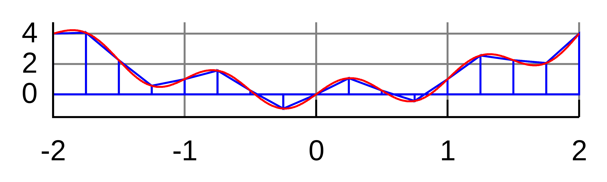

```{r setup, include=FALSE}
knitr::opts_chunk$set(echo = FALSE, message = FALSE, warning = FALSE)
```

## Intro

MC $\equiv$ repeated random sampling to produce numerical results such as

* generating draws from compicated distributions and/or domains
* integration
  - calculation of moments
  - normalizing constants (a measure $\Rightarrow$ a distribution)
* optimization
  - mode evaluation

\bigskip
  
\begin{exampleblock}{}
\centering \textbf{Basic idea}: If we can sample from a process, we can learn a lot about it by doing statistics on the simulated samples (as opposed to analyzing the process itself).
\end{exampleblock}

MC $\equiv$ simulation-based statistical techniques

## Example

$(X_1,Y_1)^\top,\ldots,(X_N,Y_N)^\top$ a sample from the standardized bi-variate Gaussian distribution
\[
\mathcal{N}\left(\begin{pmatrix} 0 \\ 0 \end{pmatrix}, \begin{pmatrix} 1 & \rho \\ \rho & 1 \end{pmatrix} \right)
\]

* We want to test $H_0: \rho = \rho_0$ against $H_1: \rho \neq \rho_0$.

* Statistic: $\widehat{\rho} = N^{-1} \sum_{n=1}^N X_n Y_n$.

Since the data generation process is fully determined under $H_0$, we can simulate data to approximate the distribution and thus also the $p$-value.

\bigskip
  
\begin{exampleblock}{}
\centering To test a hypothesis, we only need to simulate data under $H_0$.
\end{exampleblock}

## Intro

\centering
\includegraphics[width=0.5\textwidth]{../Plots/roulette.jpg}

# Random Number Generation (RNG)

## RNG

True randomness is hard to come by. Historically:

\begin{columns}
\column{0.7\textwidth}

\begin{itemize}
\item dice, cards, coins
\item physical processes
\item census data, tables, etc.
\end{itemize}

\bigskip
\textbf{John von Neumann}: \textbf{pseudo-RNG}

\smallskip
\begin{itemize}
\item approximates the desired distribution for $N \to \infty$
\item cannot be predicted
\item pass a set of independence tests
\item repeatability ($\Rightarrow$ reproducibility)
\item long cycle (before it starts repeating)
\item fast sampling
\end{itemize}

\column{0.3\textwidth}\centering
\includegraphics[width=\textwidth]{../Plots/JVN.jpg}
\end{columns}

\bigskip
Today: IEEE Arithmetic Standard.

## Cornerstone: Generating from $\mathcal{U}[0,1]$

Assume now we can generate numbers from the $\mathcal{U}[0,1]$ distribution.

* e.g. the *linear congruential method*
\[ X_{n} = (a X_{n-1} + c) \,\mathrm{mod}\, m, \quad n=1,2,\ldots, \]
where $a,c,m$ and $X_0$ are cleverly chosen fixed numbers, can fulfill the pseudo-RNG requirements.
  - typically $U_n = X_n/2^{31}$
* now, better and much more complicated algorithms are available
  - every piece of software has its favorite pseudo-RNG
  - out of the scope of our course

**Question**: How do we generate from other distributions?

## Transforms

\begin{exampleblock}{}
\textbf{Lemma.} (\textit{Inverse Transform.})\\
Let $U \sim \mathcal{U}[0,1]$ and $F$ be a distribution function and $F^{-1}$ the quantile function. Then $X = F^{-1}(U) \sim F$.
\end{exampleblock}

**Proof**: Simply $P(X \leq x) = P(F(X) \leq F(x)) = P(U \leq F(x)) = F(x)$.

The lemma is general, but not almighty:

* distribution/quantile functions can be complicated/unknown
  - e.g. $\mathcal{N}(0,1)$

Often, simpler relationships can be used: [diagram](http://www.math.wm.edu/~leemis/chart/UDR/UDR.html)

* still, there is no arrow there between $\mathcal{U}[0,1]$ and $\mathcal{N}(0,1)$, generating $\mathcal{N}(0,1)$ is actually a bit tricky...

## Transforms

\begin{exampleblock}{}
\textbf{Lemma.} (\textit{Box-Muler transform.})\\
 Let $U_1,U_2 \sim \mathcal{U}(0,1)$ be independent. Then
\[
Z_1 = \sqrt{-2 \log(U_1)} \cos(2\pi U_2) \quad \& \quad Z_2 = \sqrt{-2 \log(U_1)} \sin(2\pi U_2)
\]
are two independent standard Gaussian random variables.
\end{exampleblock}

Again, software uses its favorite relationships.

* e.g. $R$ has tabulated $F$ and $F^{-1}$ for $\mathcal{N}(0,1)$ to a high precision and actually uses the inverse transform, because evaluating trigonometric functions is rather expensive
* `?rnorm` $\Rightarrow$ `rnorm`, `pnorm`, `qnorm`, `dnorm` help

## Rejection Sampling

\small
**Setup**: we know how to simulate from a *proposal* $g$, we want to simulate from a *target* $f$

* let $f$ and $g$ have the same support ($f(x) > 0 \Leftrightarrow g(x) > 0$)
* let there be $c \geq 1$ such that $\forall x : \, f(x) \leq c \, g(x)$

**Algorithm**: (to draw a single sample $X$ from $f$)

1. Draw a proposal $Y$ from $g$.
2. Draw $U \sim \mathcal{U}(0,1)$.
3. If $U  < \frac{1}{c} \frac{f(Y)}{g(Y)}$, accept $X = Y$ and stop, otherwise go back to 1.

\begin{columns}
\column{0.5\textwidth}
\textbf{Example}:
\begin{itemize}
\item $\mathcal{U}[0,1]$ proposal
\item $\mathcal{B}(2,5)$ target
\item $c \approx 2.5$
\end{itemize}
\column{0.5\textwidth}
```{r,echo=F,out.width="80%",fig.align='center'}
op <- par(ps=30)
x <- 1:1000/1001
M <- optimize(f=function(x){dbeta(x,2,5)}, interval=c(0,1),maximum=T)$objective
plot(x,dbeta(x,2,5),type="l",col="red",xlab="",ylab="")
points(x,rep(M,1000),type="l",col="blue")
```
\end{columns}

## Rejection Sampling

Does the algorithm really sample from $f$?
\[
\begin{split}
P(X \leq x) &= P\Bigg(Y \leq x \,\Bigg|\, U \leq \underbrace{\frac{1}{c} \frac{f(Y)}{g(Y)}}_{=:t(Y)} \Bigg)
= \frac{P(Y \leq x \,\wedge\, U \leq t(Y) )}{P(U \leq t(Y) )}\\
&= \frac{\int^x \int^{t(y)}d u\, g(y) d y}{\int \int^{t(y)}d u\, g(y) d y} 
= \frac{\int^x t(y) g(y) d y}{\int t(y) g(y) d y} = \frac{\int^x \frac{1}{c} f(y) d y}{\int \frac{1}{c} f(y) d y} \\
&= \frac{\frac{1}{c} F(x)}{\frac{1}{c}} = F(x),
\end{split}
\]

The rejection sampling algorithm above is again quite general, but it needs

* a good proposal $g$
  - with a similar shape to the target density, leading to
  - high acceptance probability $1/c$
* fast evaluation of $f$ and $g$

## Example: $\mathcal{N}(0,1)$ again

**Goal**: Simulate data from the standard Gaussian target using the doubly exponential proposal, i.e.
\[
f(x) = \frac{1}{\sqrt{2\pi}} e^{-\frac{x^2}{2}} \quad \& \quad g(x) = \frac{\alpha}{2} e^{-\alpha |x|}, \text{ where } \alpha > 0.
\]

\begin{columns}
\column{0.6\textwidth}
```{r,out.width="100%",fig.align='center'}
M <- optimize(f=function(x){dnorm(x)/dexp(abs(x))*2}, interval=c(0,5),maximum=T)$objective

x <- 1:5000/1001
op <- par(ps=20)
plot(c(-rev(x),x),M*c(rev(dexp(x))/2,dexp(x)/2),type="l",col="blue",xlab="",ylab="",
     main="Target and scaled proposal densities")
points(c(-rev(x),x),c(rev(dnorm(x)),dnorm(x)),type="l",col="red")
```
\column{0.4\textwidth}
Another way of obtaining $\mathcal{N}(0,1)$ from $\mathcal{U}(0,1)$:
\[
\begin{split}
\mathcal{U}[0,1] &\longrightarrow Exp(1) \\
Exp(1) &\longrightarrow DbExp(1) \\
DbExp(1) &\longrightarrow N(0,1)
\end{split}
\]
\end{columns}

# Numerical Integration

## Deterministic Approaches

**Goal**: approximate $J = \int_a^b f(x) d x$

*Quadrature method*: evaluate the function on a grid
\[
S_K = K^{-1} \sum_{k=1}^K f(t_k)
\]

* if $f$ is nice (smooth), $S_K \to J$ for $K\to \infty$.
* corresponds to integrating a local constant interpolation of $f$
* local linear interpolation (*trapezoidal rule*) or local quadratic (*Simpson's rule*) are also well known

```{r, echo=F, out.width='30%', fig.align="center", fig.show="hold"}
knitr::include_graphics('../Plots/numerical_integration/local_constant_rule.png')

knitr::include_graphics('../Plots/numerical_integration/local_quadratic_rule.png')
```

## Naive Monte Carlo

\[
J = \int_a^b f(x) d x = \E\big[f(U)\big] \quad \text{for} \quad U \sim \mathcal{U}[a,b]
\]
$\Rightarrow$ generate $X_1,\ldots,X_N$ from $\mathcal{U}[a,b]$ and approximate $J$ by
\[
\widehat{J}_N = N^{-1} \sum_{n=1}^N f(X_n)
\]

* consistency due to SLLN
* monitoring convergence via CLT-based confidence intervals:
\[
\sqrt{N}\frac{\widehat{J}_N - J}{v_N} \stackrel{\cdot}{\sim} \mathcal{N}(0,1) \,, \quad \text{where} \quad v_N = \frac{1}{N} \sum_{n=1}^N \big[ f(X_n) - \bar{f}_N \big]^2
\]
  - beware of a **silent failure** (e.g. when $f$ explodes on a very small subinterval of $[a,b]$ and we have no samples there, the conficence intervals are overly optimistic)

## Importance Sampling

\[
J := \int_\mathcal{X} f(x) d x = \int_\mathcal{X} \frac{f(x)}{g(x)} g(x) d x =
\E_g \left[ \frac{f(X)}{g(X)} \right].
\]
for any $g$, so sampling $X_1,\ldots,X_N \sim g$, we can approximate J by
\[
\widehat{J}_N := \frac{1}{N}\sum_{n=1}^N \frac{f(X)}{g(X)}.
\]

* still consistency and conficence intervals available from LLN and CLT
* notably, the asymptotic variance is given by
\[
\mathrm{var}\big(\widehat{J}_N\big) = \frac{1}{N} \int_\mathcal{X} \left( \frac{f(x)}{g(x)} -  \E_g \left[ \frac{f(X)}{g(X)} \right] \right)^2 g(x) d x,
\]
which is small if $f/g$ is approximately constant on $\mathcal{X}$

## Intuitive Explanation

* when $f$ is flat (all regions are equally important), both the naive MC and deterministic approaches need only few samples
* when $f$ is not flat, using $g$ allows us to encode which regions are important $\Rightarrow$ "importance sampling"
* **key**: integrating $f$ amounts to integrating $f/g$ under sampling from $g$
* if $f/g$ is flat, only few samples are needed

Of course, finding $g$ which

* has a similar shape to $f$ and
* we can easily sample from it

is not always easy

## Examples

Approximately calculate $P(2 < X < 6)$ for the target distribution $X \sim f$ using a reference $g$

```{r,out.width="30%",fig.show='hold',fig.align='center',fig.cap="Gaussian target, Exponential reference - densities (left), their ratio (middle), importance sampling error (right)."}
op <- par(ps=30)
x <- 6*(1:1000)/1001
plot(x,dnorm(x),type="l",ylab="")
points(x,dexp(x),type="l",col="blue")
abline(v=c(2,6),lty=2)

plot(x,dnorm(x)/dexp(x),type="l",ylab="")
abline(v=c(2,6),lty=2)

set.seed(696)
x=rexp(10^5)
wein=dnorm(x)/dexp(x)
# boxplot(wein/sum(wein))
plot(log10(1:10^5),cumsum(wein*(x>2)*(x<6))/cumsum(rep(1,10^5)),type="l",ylim=c(0,0.05),xlab="log(N)",ylab="")
abline(a=pnorm(6)-pnorm(2),b=0,col="sienna")
```

## Examples

Approximately calculate $P(2 < X < 6)$ for the target distribution $X \sim f$ using a reference $g$

```{r,out.width="30%",fig.show='hold',fig.align='center',fig.cap="Cauchy target, Exponential reference - densities (left), their ratio (middle), importance sampling error (right)."}
op <- par(ps=30)
x <- 6*(1:1000)/1001
plot(x,dcauchy(x),type="l",ylab="")
points(x,dexp(x),type="l",col="blue")
abline(v=c(2,6),lty=2)

plot(x,dcauchy(x)/dexp(x),type="l",ylab="")
abline(v=c(2,6),lty=2)

set.seed(696)
x=rexp(10^5)
wein=dcauchy(x)/dexp(x)
# boxplot(wein/sum(wein))
plot(log10(1:10^5),cumsum(wein*(x>2)*(x<6))/cumsum(rep(1,10^5)),type="l",ylim=c(0,0.3),xlab="log(N)",ylab="")
abline(a=pcauchy(6)-pcauchy(2),b=0,col="sienna")
```

## Examples

Approximately calculate $P(2 < X < 6)$ for the target distribution $X \sim f$ using a reference $g$

```{r,out.width="30%",fig.show='hold',fig.align='center',fig.cap="Cauchy target, Gaussian reference - densities (left), their ratio (middle), importance sampling error (right)."}
op <- par(ps=30)
x <- 6*(1:1000)/1001
plot(x,dcauchy(x),type="l",ylab="")
points(x,dnorm(x),type="l",col="blue")
abline(v=c(2,6),lty=2)

plot(x,dcauchy(x)/dnorm(x),type="l",ylim=c(0,10),ylab="")
abline(v=c(2,6),lty=2)

set.seed(491)
x=rnorm(10^5)
wein=dcauchy(x)/dnorm(x)
# boxplot(wein/sum(wein))
plot(log10(1:10^5),cumsum(wein*(x>2)*(x<6))/cumsum(rep(1,10^5)),type="l",ylim=c(0,0.3),xlab="log(N)",ylab="")
abline(a=pcauchy(6)-pcauchy(2),b=0,col="sienna")
```

* the tails of Cauchy and Gaussian distributions are too different $\Rightarrow$ importance sampling performs poorly
* if we can simulate from Gaussian, we can simulate directly from Cauchy: $Z_1,Z_2 \sim \mathcal{N}(0,1)$ independent $\Rightarrow$ $Z_1/Z_2 \sim Cauchy(0,1)$

## Changing the Reference Measure

\small
Often, we are interested directly in the integrals of the form
\[
\E_g \big[ f(X) \big] = \int_\mathcal{X} f(x) g(x) d x
\]
and if simulation from $g$ is readily available, we can proceed as above. If simulation from $g$ is **difficult**, we can change the reference measure from $g$ to some $h$ and simulate from $h$ instead:
\[
\E_g \big[ f(X) \big] = \int_\mathcal{X} f(x) \frac{g(x)}{h(x)} h(x) d x = \E_h \left[ f(X) \frac{g(X)}{h(X)} \right].
\]

Hence we have a lot of freedom how to sample (i.e. how to choose the reference measure), but there is a certain trade-off: we want to

* have the integrand as flat as possible
* be able to simulate from the reference measure efficiently

\footnotesize
When $\mathcal{X} = \R$, it is important to match the decay of the tails between the target and reference measures. This is the case for both rejection and importance sampling schemes, and it makes them practically not that useful in more complicated examples (where the tail behavior might not even be known).

## Variance Reduction

Accuracy of MC integration is assessed by the estimator's variance. There are ways to tweak the sampling scheme in order to reduce the variance

* importance sampling (we have seen above)

* correlated sampling (next slide)
  
* quasi-random sampling
  - Example: We want to calculate $\int_0^1 f(x) d x$. Instead of sampling $X_1,\ldots, X_N$ uniformly on $[0,1]$, we could take a regular grid $t_1,\ldots,t_K$ and introduce randomness by taking $X_{k,j} := t_k + U_j \text{ mod } 1$ where $U$'s are sampled uniformly on $[0,1]$.
  - i.e. something between MC and deterministic methods
  
* many other techniques: stratified sampling, multi-level sampling, etc.

## Correlated Sampling

Say we want to estimate $\E Z$ with $Z = X - Y$. We can sample independently $X_1,\ldots,X_N$ and $Y_1,\ldots,Y_N$, form $Z_n = X_n - Y_n$ for $n=1,\ldots,N$, and estimate $\E Z$ empirically as $N^{-1} \sum Z_n$. The variance of this estimator is governed by \[\mathrm{var}(Z_n) = \mathrm{var}(X_n) + \mathrm{var}(Y_n) - 2 \underbrace{\mathrm{cov}(X_n,Y_n)}_{=0 \text{ since } X_n \independent Y_n},\]

* if we alter the sampling such that $\mathrm{cov}(X_n,Y_n) > 0$, we reduce the sampling variance of our estimator.

**Take-home message**: When evaluating several different estimators via simulations, the same simulated data sets should be used for all the estimators.

* simulation studies are MC in a sense - you have already used MC (in Assignment 4) without realizing it :)

## References

Donald Knuth (1997, 3rd ed.) *The Art of Computer Programming*, vol. 2

Robert \& Casella (2010) *Introducing Monte Carlo methods with R*

## Assignment [5 %]

We currently have 3 ways of generating Gaussian samples in `R`:

* the native `rnorm()` using the inverse transform
* Box-Muller transform
* rejection sampling (see lecture notes for code)

For 50 simulation runs, and for all three methods:

 * generate $10^5$ samples using
 * time the generation process using `Sys.time()`
 * calculate the KS statistic ([the one-sample Kolmogorov-Smirnov statistic](https://en.wikipedia.org/wiki/Kolmogorov%E2%80%93Smirnov_test)) to check quality of the sample, e.g.
   - ```{r,echo=T,eval=F}
   X <- rnorm(10^5)
   F_hat <- ecdf(X)
   F_hat_eval <- F_hat(sort(X))
   F_eval <- pnorm(sort(X))
   KS_stats <- max(abs(F_hat_eval - F_eval))
   ```
Compare the three methods using your simulation results.


